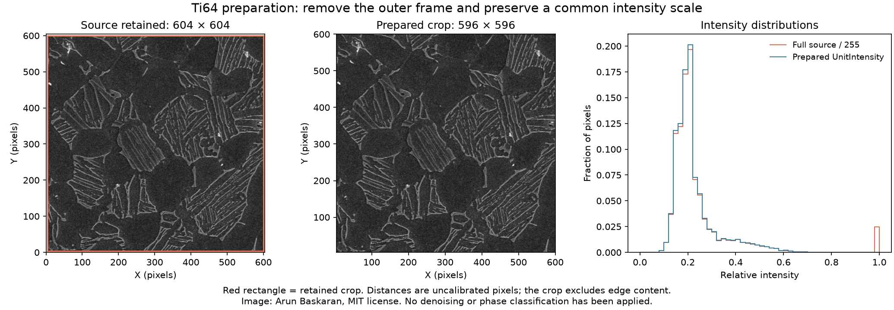

# Ti64 Image Preparation

Executable pipeline: `(01) Ti64 Image Preparation.d3dpipeline`

> **Before adapting:** This pipeline is configured for the supplied Ti-6Al-4V image. Review its input requirements, assumptions, and parameters before using other data. Do not treat this example as a validated acceptance procedure. Adapt and validate it for the scanner, material, resolution, and quality requirement.

## At a glance

- **Input:** A 604 × 604 grayscale micrograph derived from a public, paper-linked Ti-6Al-4V image.
- **Result:** The full source image, a 596 × 596 prepared crop, floating-point intensity and normalized intensity, and whole-crop statistics in one DREAM3D checkpoint.
- **Main choice:** Keep the original raster intact and prepare one common input for later smoothing and threshold comparisons.
- **Run order:** Run this pipeline first. The smoothing comparison reads its checkpoint; the threshold comparison then reads the smoothing checkpoint.

## Purpose and real-world setting

This example prepares one common image before smoothing and threshold comparisons. The input, `Data/ImageProcessing_Examples/materials/microstructure_grayscale.png`, comes from an [Arun Baskaran paper-linked repository](https://github.com/ArunBaskaran/Image-Driven-Machine-Learning-Approach-for-Microstructure-Classification-and-Segmentation-Ti-6Al-4V) under MIT terms. Its original RGBA image was converted to 8-bit grayscale without resizing or cropping. This pipeline category's `SourceDataLicense.txt` gives the source notice. `Data/ImageProcessing_Examples/Provenance.json` in the archive gives hashes and transformations.

[Fotos, Campbell, Murray, and Yakushina (2023)](https://doi.org/10.1007/s10853-023-08901-w) study learned boundary classes and marker watershed in titanium microstructures. The paper has a [CC BY 4.0 license](https://creativecommons.org/licenses/by/4.0/). Its figures provide qualitative context for globular regions, lath colonies, and bright boundaries. This preprocessing example does not reproduce its results.

Run from the working directory containing `Data`. In the GUI, set absolute file paths if relative paths fail. The `.d3dpipeline` is executable authority; the `.yaml` repeats its parameters.

## Data flow and choices

| Stage | Choice, alternative, and pitfall |
|---|---|
| Read Image → `Source Image/Cell Data/Intensity` | Import all 604 × 604 × 1 pixels as `uint8`. Set origin [0, 0, 0], spacing [1, 1, 1], and UI length unit Unknown. There is no reliable physical calibration. Import cropping would remove the source pixels from the checkpoint. |
| Crop Image Geometry → `Ti64` | Copy inclusive X/Y voxels 4 through 599 and Z voxel 0 into a new image geometry. Keep `Source Image`; do not renumber features because there are no feature labels. The crop is 596 × 596 × 1, with origin [4, 4, 0]. The four-pixel symmetric inset removes the white frame, but also discards one partly nonwhite column at the right edge. This is a conservative teaching choice, not a crop specified by the paper. Inspect the edge if that column matters to your question. |
| Convert Data → `Ti64/Cell Data/FloatIntensity` | Convert copied `uint8` to `float32` while keeping `Intensity`. Read Image only offers unsigned integer outputs. Conversion preserves 8-bit values exactly and avoids integer rounding between later filter passes. |
| Rescale Intensity → `UnitIntensity` | Map observed crop endpoints linearly to 0 and 1, once before branching. A different image histogram changes this mapping; it is not radiometric calibration. |
| Compute Array Statistics → `Ti64/UnitIntensitySummary` | Store Length, Minimum, Maximum, Mean, Median, and StandardDeviation across all pixels. No mask or feature index is used. These values help detect preparation errors; they do not identify phases. |
| Write DREAM3D | Save `Data/Output/Ti64_Image_Cleanup_Examples/Preparation/Ti64_Prepared.dream3d`, compression level 5, XDMF off. Both geometries remain available. |

No smoothing, segmentation, `FeatureIds`, or phase labels are created.

## Independent checks and interpretation

Open the saved checkpoint and check both geometries. `Source Image` must be 604 × 604 × 1, origin [0, 0, 0], spacing [1, 1, 1], and `Intensity` must retain every source pixel as `uint8`. `Ti64` must be 596 × 596 × 1, with origin [4, 4, 0] and the same spacing. The crop has **355,216** cells. Compare `Ti64/Cell Data/Intensity` with source X/Y indices [4:600, 4:600]; corresponding pixel values must match exactly. Compare `FloatIntensity` with those integers after conversion; the numerical values must still match exactly.

`UnitIntensity` is `float32`, ranges from 0 to 1, and has summary `Length` **355,216**, `Mean` **0.22745**, `Median` **0.20000**, and population `StandardDeviation` **0.09324**. The standard deviation divides by the pixel count, N. These reference values describe this crop, not acceptance targets for other images. Visually check that the external frame is removed while internal contrast remains recognizable.

Brightness depends on acquisition and preparation; it does not prove a phase, grain boundary, or calibrated area fraction. Treat the geometry as uncalibrated pixel coordinates. Do not convert pixel lengths to micrometers without independent calibration.

## Differences from the paper and extension

HADMA learns boundary classes that guide watershed markers. A simple intensity threshold does not replace that map. This crop and normalization are teaching choices, not paper settings or optimized parameters. Do not compare later masks with the paper's accuracy figures.

To study the published method, verify trained weights, reproduce its input preprocessing and inference, retain class and boundary maps, and construct watershed markers from them. Evaluate with labeled images and a documented validation split. Record acquisition scale before reporting physical dimensions. For conventional processing, vary one smoothing or threshold parameter from this baseline and compare against reference labels, noting lost or merged boundaries and laths.
