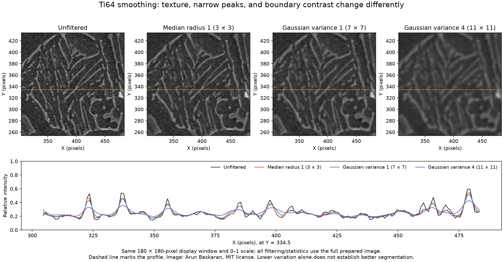

# Ti64 Smoothing Comparison

Executable pipeline: `(02) Ti64 Smoothing Comparison.d3dpipeline`

> **Before adapting:** This pipeline is configured for the supplied Ti-6Al-4V image. Review its input requirements, assumptions, and parameters before using other data. Do not treat this example as a validated acceptance procedure. Adapt and validate it for the scanner, material, resolution, and quality requirement.

## At a glance

- **Input:** `Data/Output/Ti64_Image_Cleanup_Examples/Preparation/Ti64_Prepared.dream3d`, made by `(01) Ti64 Image Preparation.d3dpipeline` from a paper-linked grayscale image.
- **Result:** Three smoothed `float32` arrays, three whole-crop summaries, and every preparation array and geometry in a new DREAM3D checkpoint.
- **Main choice:** Compare a 3 × 3 median with discrete Gaussian variance 1 and 4 pixel² on the same original normalized crop.
- **Run order:** Run preparation first, this pipeline second, and `(03) Ti64 Threshold Sensitivity.d3dpipeline` after this checkpoint exists.

## Purpose and real-world setting

A metallographer may smooth a micrograph before examining boundaries or trying a segmentation method. Smoothing can suppress isolated intensity changes, but it can also erase fine laths or merge bright boundaries. This example places three candidate results side by side so that the effect can be inspected before a downstream choice. It does not select an optimal denoiser.

The input is the `Ti64` crop from the preparation pipeline: 596 × 596 × 1 pixels, origin [4, 4, 0], spacing [1, 1, 1], and uncalibrated pixel coordinates. Its `Ti64/Cell Data/UnitIntensity` array is `float32` in the 0–1 range. The preparation checkpoint also retains the full 604 × 604 source image, cropped `uint8` intensity, `FloatIntensity`, and `UnitIntensitySummary`. No physical pixel scale was established; variance and kernel sizes here have pixel-space meanings only.

The grayscale raster derives from the public [Arun Baskaran paper-linked Ti-6Al-4V repository](https://github.com/ArunBaskaran/Image-Driven-Machine-Learning-Approach-for-Microstructure-Classification-and-Segmentation-Ti-6Al-4V). The original RGBA source was converted to 8-bit grayscale without resizing. `SourceDataLicense.txt` beside this pipeline gives its MIT notice, and `Data/ImageProcessing_Examples/Provenance.json` in the data archive records hashes and transformations. [Fotos, Campbell, Murray, and Yakushina (2023)](https://doi.org/10.1007/s10853-023-08901-w) provide the paper context under [CC BY 4.0](https://creativecommons.org/licenses/by/4.0/). The paper's learned boundary-class and watershed method is outside this example.

Run from a working directory containing `Data`. In the GUI, use absolute paths if relative paths do not resolve. The `.d3dpipeline` contains the executable parameters; the `.yaml` companion repeats them for discovery.

## Data flow and choices

| Stage | Why this choice; alternative and pitfall |
|---|---|
| Read DREAM3D | Load the full preparation checkpoint. Keeping both geometries and all source and preparation arrays makes changes traceable. Running this file before preparation produces a missing-input error. |
| Median Image → `Ti64/Cell Data/MedianR1` | Radius [1, 1, 0] is the smallest nontrivial square XY neighborhood: 3 × 3 pixels. It tests local suppression before expanding the affected region. A median can remove isolated bright or dark pixels while preserving some sharp transitions. It may also remove narrow true features; no noise labels establish that such pixels are defects. |
| Discrete Gaussian → `GaussianV1` | Use variance [1, 1, 0] pixel², maximum error [0.01, 0.01, 0.01], maximum kernel width 32, and image spacing off. This nominally corresponds to σ = 1 pixel on each XY axis. The filter uses a discrete modified-Bessel kernel, with 7 × 7 support for these settings, not a sampled continuous Gaussian. |
| Discrete Gaussian → `GaussianV4` | Hold every setting except variance, which becomes [4, 4, 0] pixel², nominal σ = 2 pixels. The native discrete kernel has 11 × 11 support for these settings. This tests smoothing strength within one method; comparing it with the median also changes the method. Stronger smoothing may blur thin boundaries. |
| Compute Array Statistics × 3 | Summarize each result in `Ti64/MedianR1Summary`, `Ti64/GaussianV1Summary`, and `Ti64/GaussianV4Summary`. Length, Minimum, Maximum, Mean, Median, and population StandardDeviation use all cells, with no mask or feature index. `UnitIntensitySummary` remains from preparation. Summary shifts alone cannot measure boundary preservation. |
| Write DREAM3D | Save `Data/Output/Ti64_Image_Cleanup_Examples/Smoothing/Ti64_SmoothingComparison.dream3d` with compression level 5 and XDMF off. The full source geometry and prepared crop remain available. |

All three filters read the **same original** `UnitIntensity`; they are independent branches, not consecutive passes. Variances 1 and 4 give a baseline and doubled nominal Gaussian standard deviation; the median and Gaussian settings are not matched for equivalent smoothing strength. There is no rescaling after a branch. The `float32` input also avoids intermediate integer rounding in the Gaussian passes. All neighborhoods repeat the nearest edge value outside the image. The median therefore includes a full 3 × 3 window at an edge; it does not use a clipped, smaller window. The Z radius and variance are zero for this single-slice image.

## Comparison and interpretation

Open the saved checkpoint and inspect `UnitIntensity`, `MedianR1`, `GaussianV1`, and `GaussianV4` with the same display range of 0–1. Use identical zoom and position near isolated intensity changes, thin laths, and bright boundaries. Check that the original and all three output arrays are `float32`, contain 355,216 cells, and belong to the unchanged `Ti64` geometry. Check that `Source Image` and `UnitIntensitySummary` are still present. These are structural checks; they do not establish scientific quality.

| Array | Length | Minimum | Maximum | Mean | Median | Population standard deviation |
|---|---:|---:|---:|---:|---:|---:|
| `UnitIntensity` | 355,216 | 0 | 1 | 0.22745 | 0.20000 | 0.09324 |
| `MedianR1` | 355,216 | 0.04314 | 0.96863 | 0.22451 | 0.20000 | 0.08049 |
| `GaussianV1` | 355,216 | 0.08105 | 0.91163 | 0.22745 | 0.20251 | 0.07531 |
| `GaussianV4` | 355,216 | 0.12757 | 0.73621 | 0.22745 | 0.20689 | 0.05964 |

These are reference values for the supplied crop. The figure uses the same 180 × 180-pixel display window for every array; the dashed line marks the intensity profile below it. All calculations use the full prepared image. A lower standard deviation or smoother appearance does not by itself mean a better microstructural measurement. Compare against labeled boundaries, repeated acquisitions, or another independent reference before choosing a setting for a specific acquisition.

## Differences from the paper and extension

The cited paper uses a learned boundary-class semantic model, followed by marker-based watershed, to identify microstructural features. This example uses native median and discrete Gaussian image filters for a controlled sensitivity exercise. Its crop, 0–1 rescaling, radii, and variances are illustrative choices, not reported paper parameters. It creates no phase or grain labels and cannot support the paper's accuracy or morphology claims.

To extend this comparison toward that method, obtain the trained model and match its documented input preparation before inference. The rescaling and smoothing here are **not automatically beneficial** to a trained semantic model: they may shift its input distribution or remove boundary evidence. Preserve the class and boundary probability maps, build the watershed markers as specified, and compare outputs with labeled reference images using a documented split. Calibrate pixel size independently before reporting physical grain dimensions. For a conventional threshold workflow, run the next example, then compare mask differences against reference labels and inspect which thin structures are lost or merged.
