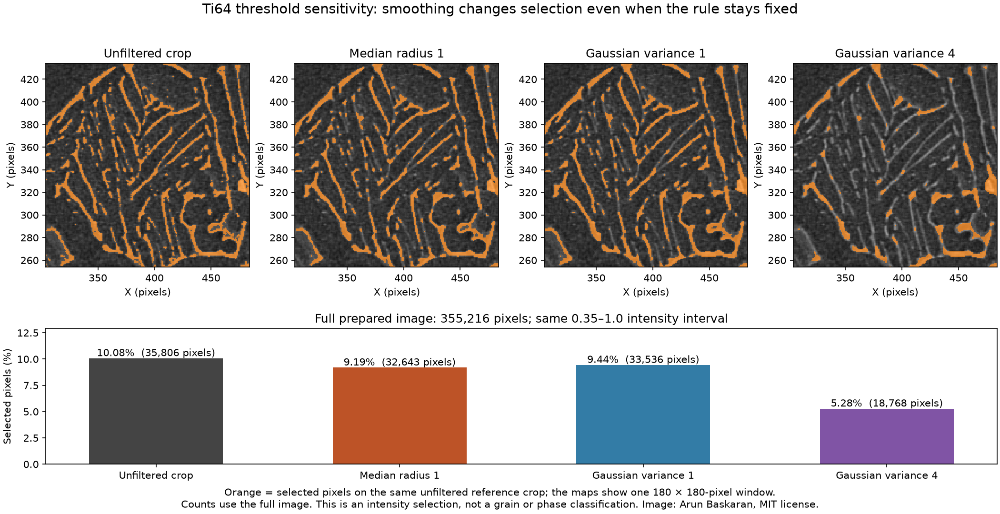

# Ti64 Threshold Sensitivity

Executable pipeline: `(03) Ti64 Threshold Sensitivity.d3dpipeline`

> **Before adapting:** This pipeline is configured for the supplied Ti-6Al-4V image. Review its input requirements, assumptions, and parameters before using other data. Do not treat this example as a validated acceptance procedure. Adapt and validate it for the scanner, material, resolution, and quality requirement.

## At a glance

- **Input:** `Data/Output/Ti64_Image_Cleanup_Examples/Smoothing/Ti64_SmoothingComparison.dream3d`, made by `(02) Ti64 Smoothing Comparison.d3dpipeline` after `(01) Ti64 Image Preparation.d3dpipeline`.
- **Result:** Four `uint8` brightness masks, four whole-crop summaries, and all input arrays and both geometries in a new DREAM3D checkpoint.
- **Main choice:** Apply the same inclusive 0.35–1.0 intensity interval to the unfiltered normalized crop and three independently smoothed versions.
- **Run order:** Run preparation, smoothing, then this threshold pipeline. Preparation alone does not contain the three smoothing outputs required here.

## Purpose and real-world setting

A metallographer can inspect how an image preparation choice changes which pixels exceed a fixed brightness cutoff. A selected pixel may be part of a bright boundary, a bright constituent, or an image artifact. This pipeline compares the masks created from `UnitIntensity`, `MedianR1`, `GaussianV1`, and `GaussianV4` while holding the selection rule constant. It shows sensitivity to smoothing; it does not identify microstructural phases or grains.

The prepared `Ti64` crop is 596 × 596 × 1, with 355,216 cells, origin [4, 4, 0], and spacing [1, 1, 1] in uncalibrated pixels. `UnitIntensity` is the unfiltered, normalized **crop**, not the full 604 × 604 source frame. The three smoothing arrays are `float32` outputs from the same crop. The smoothing checkpoint retains `Source Image`, the cropped source intensity, preparation arrays, prior summaries, and both image geometries.

The raster derives from the public [Arun Baskaran paper-linked Ti-6Al-4V repository](https://github.com/ArunBaskaran/Image-Driven-Machine-Learning-Approach-for-Microstructure-Classification-and-Segmentation-Ti-6Al-4V). The RGBA source was converted to grayscale without resizing. `SourceDataLicense.txt` beside this pipeline contains the MIT notice; `Data/ImageProcessing_Examples/Provenance.json` in the data archive records hashes and transformations. [Fotos, Campbell, Murray, and Yakushina (2023)](https://doi.org/10.1007/s10853-023-08901-w) provide the material context. Their learned boundary-class method and watershed are outside this example.

Run from a working directory containing `Data`. In the GUI, set absolute paths if relative paths do not resolve. The `.d3dpipeline` defines the executable arguments; the `.yaml` companion repeats them for discovery.

## Data flow and choices

| Stage | Why this choice; alternative and pitfall |
|---|---|
| Read DREAM3D | Load the **full smoothing checkpoint**. Reading the preparation checkpoint would omit `MedianR1`, `GaussianV1`, and `GaussianV4`. Keeping both geometries and all earlier arrays makes the branches traceable. |
| Binary Threshold Image × 4 | Read `Ti64/Cell Data/UnitIntensity`, `MedianR1`, `GaussianV1`, and `GaussianV4` independently; write `BrightOriginal`, `BrightMedianR1`, `BrightGaussianV1`, and `BrightGaussianV4` under `Ti64/Cell Data`. Each output is `uint8`: 1 for input intensity **greater than or equal to 0.35 and less than or equal to 1.0**, 0 elsewhere. This fixed interval isolates the effect of smoothing on selected pixels. |
| Compute Array Statistics × 4 | Write `Ti64/BrightOriginalSummary`, `BrightMedianR1Summary`, `BrightGaussianV1Summary`, and `BrightGaussianV4Summary`. Each uses all 355,216 cells without a mask or feature index. It records Length, Minimum, Maximum, Mean, Median, population StandardDeviation, and Summation. On a 0/1 mask, Summation is selected-pixel count and Mean is selected-pixel fraction. |
| Write DREAM3D | Save `Data/Output/Ti64_Image_Cleanup_Examples/Threshold/Ti64_ThresholdSensitivity.dream3d`, compression level 5, XDMF off. The original source geometry, prepared crop, smoothing branches, masks, and summaries remain in the checkpoint. |

The 0.35 lower bound is an **illustrative choice** that selects visible bright structures in the common 0–1 range. It is not optimized, calibrated, or taken from the paper. Upper bound 1.0 matches the prepared normalized range. Check an adapted image's range before reuse: changing minimum–maximum normalization changes which source intensities correspond to 0.35, and data above 1.0 would be excluded. An adaptive or Otsu threshold computed separately for each branch could be useful for another purpose, but it would also change the cutoff and answer a different question.

The threshold filter compares stored `float32` pixels after promotion to `double` against the `float64` bounds. It does **not** round image values to the displayed decimal 0.35. For example, a stored `float32` approximation of 0.35 can be slightly below the `double` lower bound and produce 0. This matters when checking every mask bit. Numeric 0/1 output makes the sum a count and mean a fraction; changing the inside value to 255 would change both interpretations. Display these masks over the range 0–1.

## Comparison and interpretation

Open the output checkpoint and display the four masks at the same zoom and location. Inspect isolated bright pixels, thin structures, and boundaries where smoothing changes the selection. Compare each mask pixel by pixel with the fixed rule applied to its corresponding saved `float32` input. Check that every mask has 355,216 `uint8` values and that `Source Image` and the predecessor summaries remain present. Structural preservation and numerical agreement do not establish a useful material classifier.

| Mask | Selected pixels (`Summation`) | Selected fraction (`Mean`) |
|---|---:|---:|
| `BrightOriginal` | 35,806 | 0.10080064 |
| `BrightMedianR1` | 32,643 | 0.09189620 |
| `BrightGaussianV1` | 33,536 | 0.09441016 |
| `BrightGaussianV4` | 18,768 | 0.05283546 |

These reference values describe the supplied crop. Each summary has Length 355,216; Mean = Summation / 355,216 and population StandardDeviation = √(Mean × (1 − Mean)), within floating-point rounding. Median is the median of the 0/1 values. These identities help detect mistakes but do not replace comparison against the saved input values. The figure overlays selected pixels on one common reference crop; its counts use the full prepared image.

Selected-pixel fraction is a **brightness fraction**, not a physical phase fraction, alpha fraction, grain fraction, or porosity measurement. Smoothing may move mask boundaries, remove thin bright regions, or join nearby ones. This bundle does not use reference labels to determine whether those changes improve accuracy. A defensible choice needs a labeled reference and a metric aligned with the intended task.

## Differences from the paper and extension

Fotos et al. use learned boundary-class semantic predictions and marker-based watershed for microstructural analysis. This example omits inference and watershed to isolate one controlled intensity-sensitivity question. It creates no grain identities and supports no HADMA accuracy claim. A connected bright region would still be only a connected bright region, not automatically a grain.

To extend toward the paper, obtain verified model weights and reproduce the documented model preprocessing. Retain class and boundary probability maps, implement the specified marker and watershed steps, and compare predicted labels with an independent reference on a documented split. Calibrate pixel size before reporting physical dimensions. The threshold masks here can be exploratory inputs to that work, but they cannot substitute for its semantic model or validation.

The authors publish a separate [GroundTruth dataset](https://pureportal.strath.ac.uk/en/datasets/groundtruth-sets/). Before using it, establish image identities and label meanings, align the image/label dimensions and crop, and preserve the training/test separation. Correspondence between this selected image and those labels has not been checked here.
