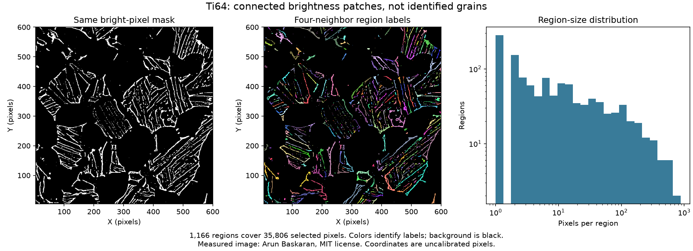

# Ti64 Connected Bright Regions

Executable pipeline: `(01) Ti64 Connected Bright Regions.d3dpipeline`

> **Before adapting:** This pipeline is configured for the supplied Ti-6Al-4V image. Review its input requirements, assumptions, and parameters before using other data. Do not treat this example as a validated acceptance procedure. Adapt and validate it for the scanner, material, resolution, and quality requirement.

## At a glance

- **Input:** `Data/Output/Ti64_Image_Cleanup_Examples/Threshold/Ti64_ThresholdSensitivity.dream3d`, made by the cleanup suite’s stage 03.
- **Result:** A `uint32` face-connected label image, an `int32` indexing copy, per-region bright-pixel counts and source-intensity statistics, a CSV, and a complete DREAM3D checkpoint.
- **Main choice:** Only shared pixel edges connect selected pixels. Corners alone do not connect them.
- **Run order:** Run the cleanup suite's 01 → 02 → 03 stages before this stage.

## Purpose and real-world setting

A metallographer can ask how many spatially separate patches a fixed brightness mask contains and how large or bright each patch is. Connected components answer that image question without assuming each patch is a grain, phase, or defect. Here the foreground is exactly the previous `BrightOriginal` array. The pipeline does not smooth, close gaps, alter the intensity threshold, or use the smoothed masks. This keeps every reported patch traceable to one saved binary input.

The source is a grayscale conversion, without resizing, of `Images1/image_500.png` in [Arun Baskaran's public Ti-6Al-4V repository](https://github.com/ArunBaskaran/Image-Driven-Machine-Learning-Approach-for-Microstructure-Classification-and-Segmentation-Ti-6Al-4V). The MIT notice is in [SourceDataLicense.txt](SourceDataLicense.txt); the data archive's `Provenance.json` records image transformations and hashes. [Fotos, Campbell, Murray, and Yakushina (2023)](https://doi.org/10.1007/s10853-023-08901-w) supply a microstructural-analysis setting. Their HADMA workflow uses learned class and boundary predictions followed by watershed. These native-filter examples are illustrative and neither reproduce that model nor assign grain or phase identities.

The `Ti64` image is a 596 × 596 × 1 crop of the 604 × 604 source. Its origin is [4, 4, 0] and spacing is [1, 1, 1] in uncalibrated pixels. `UnitIntensity` is a normalized, unfiltered crop. `BrightOriginal` is the preceding pipeline's 0/1 `uint8` selection using the inclusive [0.35, 1.0] interval. It is a brightness selection only. The input checkpoint also retains the source geometry, preparation, smoothing branches, and whole-crop summaries. All new arrays in this suite are added alongside those inputs.

Run the executable `.d3dpipeline` from a writable CLI folder containing `Data`. Relative inputs and outputs resolve from that folder. In the GUI, set absolute paths when `Data/...` does not resolve from the application launch directory. The matching `.yaml` lists the precise stored arguments for discovery; the pipeline is the executable authority. All three examples require the cleanup suite's preparation, smoothing, and threshold pipelines in that order. This suite then runs 01 before 02 or 03. Examples 02 and 03 each read the saved output of 01 and are independent of each other.

## Data flow and choices

| Stage | Choice, alternative, and pitfall |
|---|---|
| Read DREAM3D | Read the complete threshold checkpoint, including `BrightOriginal` and `UnitIntensity`. An earlier checkpoint lacks this exact mask. |
| Connected Component Image | On `Ti64/Cell Data/BrightOriginal`, use `fully_connected=false`. Nonzero foreground receives consecutive `uint32` `FaceConnectedLabels`; zero background remains zero. Face adjacency means shared edges in this 2D slice. Diagonal-only contact does not merge patches. The next example tests the alternate rule. |
| Convert Data | Copy the labels to `int32` `FaceRegionIds` for the core statistics index. Keep the `uint32` labels as the image-processing result; replacing them would hide the original label type. |
| Compute Array Statistics | Group `UnitIntensity` by `FaceRegionIds`, mask with `BrightOriginal`, and write `Ti64/FaceRegionData`. `PixelCount` counts selected pixels per region, while minimum, maximum, and mean refer to their normalized source intensity. `FeatureHasData` records populated feature rows. Index range `None` retains the label indexing. Masking excludes background from the report. |
| Export | Write normal comma-delimited CSV with `Feature_ID` and positive region rows, then save all arrays to `Connected/Ti64_ConnectedRegions.dream3d`. CSV feature IDs match this image's face labels only. |

The input is 2D within a one-slice Image Geometry. “Face” here means four neighboring pixels: left, right, above, and below. In a thicker 3D image, face connectivity means shared voxel faces. Small isolated bright pixels remain valid one-pixel components; the filter has no minimum size. A bright edge can break at one dark pixel and divide a visually continuous line. Conversely a single bright bridge can merge two shapes. Both are properties of this fixed mask, not material truths.

## Comparison and interpretation

Inspect `BrightOriginal` and `FaceConnectedLabels` at the same location. Each zero-mask pixel should have label zero; each positive label should cover one face-connected foreground set, and each region's `PixelCount` should equal the number of its labeled pixels. For this supplied crop, **1,166 regions cover 35,806 pixels**, with sizes from 1 to 873 pixels. The positive-region counts sum to that selected-pixel total. `MeanIntensity` lies between each region's minimum and maximum. These are reference values for the supplied mask; other inputs or connectivity rules can produce different counts.

The saved mask and labels cover the same pixels. Colors distinguish label IDs; they do not indicate phase. The size histogram uses logarithmic axes so both single-pixel patches and larger regions remain visible.

Unlike the paper, this image does not contain a learned class map, a learned boundary map, or watershed markers. The labels are connected brightness patches, not grains or alpha/beta phases. A next study would need aligned reference labels, documented model preprocessing and weights, the paper's marker and watershed construction, and independent overlap or boundary metrics. Physical area also requires pixel calibration; `PixelCount` is deliberately in pixels.
