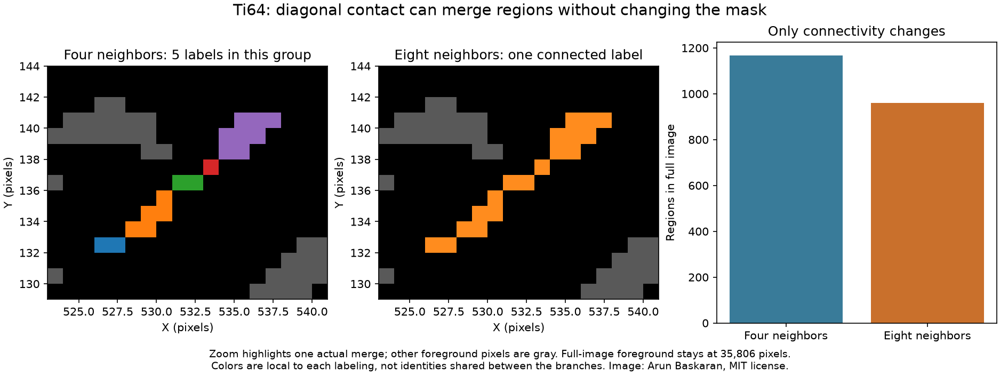

# Ti64 Connectivity Comparison

Executable pipeline: `(02) Ti64 Connectivity Comparison.d3dpipeline`

> **Before adapting:** This pipeline is configured for the supplied Ti-6Al-4V image. Review its input requirements, assumptions, and parameters before using other data. Do not treat this example as a validated acceptance procedure. Adapt and validate it for the scanner, material, resolution, and quality requirement.

## At a glance

- **Input:** `Data/Output/Ti64_Segmentation_Examples/Connected/Ti64_ConnectedRegions.dream3d`, made by stage 01.
- **Result:** New corner-inclusive `uint32` labels, `int32` indexing copy, per-region statistics and CSV, alongside the preserved face-connectivity baseline.
- **Main choice:** Compare four-neighbor and eight-neighbor connectivity on the identical binary foreground.
- **Run order:** Run cleanup 01 → 02 → 03, then segmentation 01; this stage does not depend on segmentation 03.

## Purpose and real-world setting

The same bright selection can form different region partitions depending on how pixels touch. A contact only at a corner joins two regions under full connectivity but leaves them separate under face connectivity. This example adds an eight-neighbor result to the stage 01 checkpoint so a reader can compare both definitions on the exact same saved foreground. No threshold, smoothing, or morphology changes between branches.

The source is a grayscale conversion, without resizing, of `Images1/image_500.png` in [Arun Baskaran's public Ti-6Al-4V repository](https://github.com/ArunBaskaran/Image-Driven-Machine-Learning-Approach-for-Microstructure-Classification-and-Segmentation-Ti-6Al-4V). The MIT notice is in [SourceDataLicense.txt](SourceDataLicense.txt); the data archive's `Provenance.json` records image transformations and hashes. [Fotos, Campbell, Murray, and Yakushina (2023)](https://doi.org/10.1007/s10853-023-08901-w) supply a microstructural-analysis setting. Their HADMA workflow uses learned class and boundary predictions followed by watershed. These native-filter examples are illustrative and neither reproduce that model nor assign grain or phase identities.

The `Ti64` image is a 596 × 596 × 1 crop of the 604 × 604 source. Its origin is [4, 4, 0] and spacing is [1, 1, 1] in uncalibrated pixels. `UnitIntensity` is a normalized, unfiltered crop. `BrightOriginal` is the preceding pipeline's 0/1 `uint8` selection using the inclusive [0.35, 1.0] interval. It is a brightness selection only. The input checkpoint also retains the source geometry, preparation, smoothing branches, and whole-crop summaries. All new arrays in this suite are added alongside those inputs.

Run the executable `.d3dpipeline` from a writable CLI folder containing `Data`. Relative inputs and outputs resolve from that folder. In the GUI, set absolute paths when `Data/...` does not resolve from the application launch directory. The matching `.yaml` lists the precise stored arguments for discovery; the pipeline is the executable authority. All three examples require the cleanup suite's preparation, smoothing, and threshold pipelines in that order. This suite then runs 01 before 02 or 03. Examples 02 and 03 each read the saved output of 01 and are independent of each other.

## Data flow and choices

| Stage | Choice, alternative, and pitfall |
|---|---|
| Read DREAM3D | Load stage 01, including `BrightOriginal`, `FaceConnectedLabels`, `FaceRegionIds`, and `FaceRegionData`. Do not regenerate the baseline with different parameters. |
| Connected Component Image | Run on the same `BrightOriginal` with `fully_connected=true`. In one XY slice, horizontal, vertical, and diagonal neighbors can join. Save new `uint32` `DiagonalConnectedLabels`; background stays zero. |
| Convert Data | Copy to `int32` `DiagonalRegionIds` because grouped core statistics index through signed 32-bit feature IDs. The face labels and source mask remain intact. |
| Compute Array Statistics | Group `UnitIntensity` by `DiagonalRegionIds`, mask with `BrightOriginal`, and write `DiagonalRegionData` with `PixelCount`, minimum, maximum, mean, and `FeatureHasData`. This gives a like-for-like comparison with stage 01. |
| Export | Write `Connectivity/Ti64_ConnectivityComparison.csv` with a normal `Feature_ID` header and positive IDs only, then save `Ti64_ConnectivityComparison.dream3d` with both label branches. |

Full connectivity can make a thin diagonal chain one region. Face connectivity counts its disconnected pixels or edge-connected subchains separately. Neither convention is universally correct. Pick a definition from the shape and measurement question, and document it before comparing populations. Do not compare a row with the same numeric `Feature_ID` across the two CSVs as if it were the same object: each run assigns labels independently in scan order. Compare pixel sets, overlaps, and totals instead.

## Comparison and interpretation

Display `FaceConnectedLabels` and `DiagonalConnectedLabels` over `BrightOriginal` at matching zoom. Both labels are zero outside the mask and cover exactly the same **35,806 selected pixels** inside it. Full connectivity can only merge face-connected components; it cannot split one. Here the region count falls from **1,166 to 960**. There are 154 groups that each merge multiple face-connected regions, with at most five original regions in one group. Per-region `PixelCount` sums match the selected-pixel total in both branches, although individual rows and mean intensities change when patches merge.

The zoom shows five actual face-connected regions becoming one through corner contacts. Gray pixels are other foreground regions. Colors are local to each labeling and do not establish identity between branches.

These labels describe bright image patches, not grains, phase islands, or a learned paper result. Fotos et al. rely on learned boundary and class maps plus watershed to resolve material structure; changing only adjacency cannot recover those semantics. An extension should first establish image-to-reference correspondence and pixel calibration, then compare candidate connectivity rules on a labeled validation set. Reproducing the paper would require its inference and postprocessing pipeline, not just these connected components.
