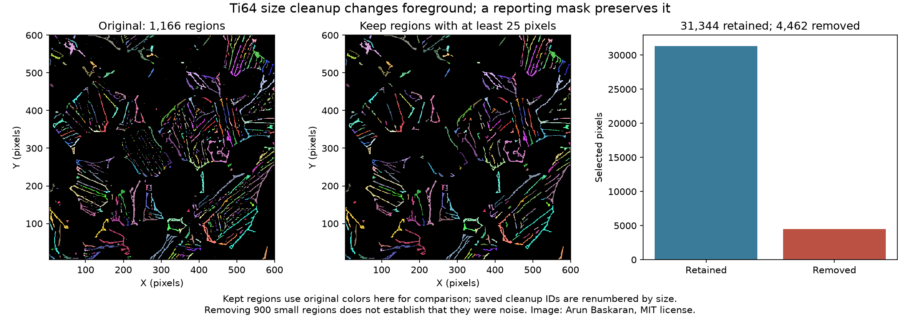

# Ti64 Minimum Size Cleanup

Executable pipeline: `(03) Ti64 Minimum Size Cleanup.d3dpipeline`

> **Before adapting:** This pipeline is configured for the supplied Ti-6Al-4V image. Review its input requirements, assumptions, and parameters before using other data. Do not treat this example as a validated acceptance procedure. Adapt and validate it for the scanner, material, resolution, and quality requirement.

## At a glance

- **Input:** `Data/Output/Ti64_Segmentation_Examples/Connected/Ti64_ConnectedRegions.dream3d`, made by stage 01.
- **Result:** Size-sorted `uint32` labels after removal of regions under 25 pixels, a cleaned-region summary and CSV, plus a report-only mask on original face-feature rows.
- **Main choice:** Compare filtering the original feature report with changing the pixel label image.
- **Run order:** Run cleanup 01 → 02 → 03, then segmentation 01; this stage does not depend on segmentation 02.

## Purpose and real-world setting

Connected-component labeling keeps every selected patch, including a single bright pixel. For a visualization or exploratory size distribution, one may want to separate larger patches from small specks. This stage demonstrates two related operations at a threshold of 25 pixels: a report-only flag on original region rows, and a new image in which smaller regions become background. The threshold is pedagogic and is not a physical detection limit or a validated noise cutoff.

The source is a grayscale conversion, without resizing, of `Images1/image_500.png` in [Arun Baskaran's public Ti-6Al-4V repository](https://github.com/ArunBaskaran/Image-Driven-Machine-Learning-Approach-for-Microstructure-Classification-and-Segmentation-Ti-6Al-4V). The MIT notice is in [SourceDataLicense.txt](SourceDataLicense.txt); the data archive's `Provenance.json` records image transformations and hashes. [Fotos, Campbell, Murray, and Yakushina (2023)](https://doi.org/10.1007/s10853-023-08901-w) supply a microstructural-analysis setting. Their HADMA workflow uses learned class and boundary predictions followed by watershed. These native-filter examples are illustrative and neither reproduce that model nor assign grain or phase identities.

The `Ti64` image is a 596 × 596 × 1 crop of the 604 × 604 source. Its origin is [4, 4, 0] and spacing is [1, 1, 1] in uncalibrated pixels. `UnitIntensity` is a normalized, unfiltered crop. `BrightOriginal` is the preceding pipeline's 0/1 `uint8` selection using the inclusive [0.35, 1.0] interval. It is a brightness selection only. The input checkpoint also retains the source geometry, preparation, smoothing branches, and whole-crop summaries. All new arrays in this suite are added alongside those inputs.

Run the executable `.d3dpipeline` from a writable CLI folder containing `Data`. Relative inputs and outputs resolve from that folder. In the GUI, set absolute paths when `Data/...` does not resolve from the application launch directory. The matching `.yaml` lists the precise stored arguments for discovery; the pipeline is the executable authority. All three examples require the cleanup suite's preparation, smoothing, and threshold pipelines in that order. This suite then runs 01 before 02 or 03. Examples 02 and 03 each read the saved output of 01 and are independent of each other.

## Data flow and choices

| Stage | Choice, alternative, and pitfall |
|---|---|
| Read DREAM3D | Load stage 01, including original `FaceConnectedLabels`, `FaceRegionIds`, `FaceRegionData`, `BrightOriginal`, and source intensity. Preserve these baseline objects. |
| Multi-Threshold Objects, feature table | Compare `Ti64/FaceRegionData/PixelCount > 24` to create `ReportableFaceRegions`. Its true rows have at least 25 pixels; original `Feature_ID` values stay stable. It marks a report and does not remove pixels or modify `FaceConnectedLabels`. |
| Relabel Component Image | Read `FaceConnectedLabels`, set `minimum_object_size=25` and `sort_by_object_size=true`, and write `uint32` `LargeRegionLabels`. Regions under 25 pixels map to zero. Survivors get new consecutive IDs ordered by decreasing pixel count; ties keep their original label order. This operation changes an output image, not the predecessor mask. |
| Convert and mask | Copy cleaned labels to `int32` `LargeRegionIds`. Select `LargeRegionLabels > 0` into boolean `LargeRegionMask` so removed pixels and existing background cannot contribute to indexed statistics. |
| Compute and export | Group `UnitIntensity` by `LargeRegionIds` under `LargeRegionMask` into `LargeRegionData`, including `PixelCount`, min/max/mean intensity, and `FeatureHasData`. CSV skips row zero and uses cleaned IDs. Save all predecessor and new arrays in `Cleanup/Ti64_MinimumSizeCleanup.dream3d`. |

The report-only flag and relabeled image identify the same surviving pixel sets, but their IDs have different meanings. Original face ID 47, the largest region at 873 pixels, becomes cleaned ID 1. Match regions by their pixels or a computed mapping, not by numeric ID. The `ReportableFaceRegions` flag is in the original feature table; the cleaned CSV is in `LargeRegionData`. No `RequireMinimumSize` reassignment occurs here: that different operation can assign small-feature pixels to neighbors, whereas this relabel filter drops them to background zero.

## Comparison and interpretation

Overlay `LargeRegionLabels` on `BrightOriginal` and compare its positive pixels with `FaceConnectedLabels`. Each retained region contains at least 25 pixels; discarded regions become zero in the cleaned image. **266 regions retain 31,344 pixels**. Removing 900 smaller regions removes 4,462 pixels, or **12.46% of the original selected pixels**. The 266 true `ReportableFaceRegions` rows select exactly the same surviving pixel sets despite reordered IDs. The sum of cleaned `PixelCount` values equals the nonzero cleaned pixel count.

The preview deliberately uses original region colors for the retained patches to make the comparison visible. Saved cleaned IDs are size-sorted. A removed region is small under this rule; that alone does not show it was noise.

The 25-pixel cutoff depends on image resolution, crop, threshold, and adjacency. With unknown physical spacing, it cannot be called a minimum square-micrometer area. The result does not identify grains or reproduce the paper's learned segmentation. A defensible application would calibrate length, define the object to detect, measure false removals and retained artifacts against independent labels, and tune the cutoff on training data before checking it on held-out images. To approach Fotos et al., first reproduce their class and boundary inference and watershed with verified references.
