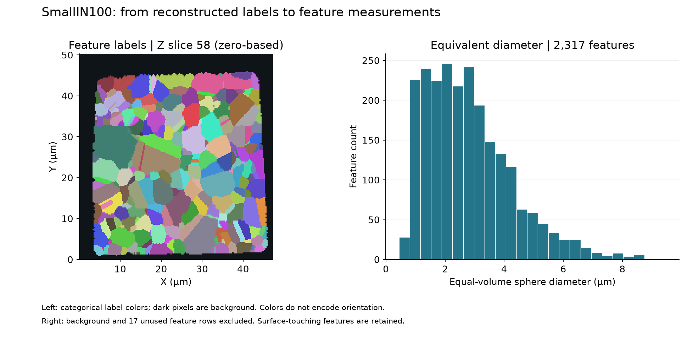

# Small IN100 Feature Measurements

Executable pipeline: `(02) Small IN100 Feature Measurements.d3dpipeline`

> **Before adapting:** This pipeline is configured for SmallIN100. Review its input requirements, assumptions, and parameters before using other data. Do not treat this example as a validated acceptance procedure. Adapt and validate it for the scanner, material, resolution, and quality requirement.

## At a glance

- **Input:** A prepared 3D volume with final `FeatureIds` and a matching feature matrix.
- **Result:** Feature centroids, sizes, and shapes in CSV and DREAM3D files.
- **For summaries:** Exclude unused rows and decide how to treat surface-truncated features.
- **Run order:** Archive -> Feature Preparation -> Feature Measurements; see the [quick start](README.md#quick-start-117-section-3d-example).

## Purpose and real-world setting

Measure where the final reconstructed features are and how large and elongated they are. This is an **illustrative** subset of the feature-statistics sequence in [Groeber and Jackson (2014), DOI 10.1186/2193-9772-3-5](https://doi.org/10.1186/2193-9772-3-5). It does not run the paper's full Table 2 sequence or reproduce its published numbers.

## Input and run order

Run the unchanged `(01) Small IN100 Archive.d3dpipeline` in `Small_IN100_Processing`, then `(01) Small IN100 Feature Preparation.d3dpipeline` in this category. This pipeline reads `Data/Output/Small_IN100_Examples/Preparation/SmallIN100_Features.dream3d`. Use the same writable CLI working folder for all three stages. The [README quick start](README.md#quick-start-117-section-3d-example) gives data setup and Windows PowerShell commands. In the GUI, open each pipeline through **File > Open** and use absolute file input/output paths if relative paths do not resolve for your installation.

The prepared input must have `DataContainer` as an image geometry, cell `DataContainer/Cell Data/FeatureIds`, and `DataContainer/Cell Feature Data` with a row for every feature ID. The Task 1 pilot input had 189 × 201 × 117 cells, 0.25 µm spacing on each axis, 2,335 feature rows, 2,317 occupied positive IDs, 17 unused positive rows, and background ID 0. Its feature matrix had no child arrays; that is valid because this pipeline creates them. Recheck these properties for any other input.

The labels are the final **FeatureIds** saved after cleanup. Saved cell `ParentIds` relate to twin merging and may no longer index the same feature matrix. These outputs are feature measurements, not twin-parent grain measurements.

## Data flow and filter choices

| Step | Purpose and key choice |
| --- | --- |
| 1. Read DREAM3D | Load the pilot checkpoint and retain its geometry, final IDs, and row space. |
| 2. Compute Feature Centroids | Average observed voxel-center positions for each `FeatureId`; `is_periodic=false` matches the finite sample. Output: `Centroids`. |
| 3. Compute Feature Sizes | Count cells per ID; `save_element_sizes=false`. Outputs: `NumElements`, `Size Volumes`, and `EquivalentDiameters`. |
| 4. Compute Shapes | Use the same IDs and new centroids to calculate `AxisLengths`, `AspectRatios`, `AxisEulerAngles`, and `Omega3s`. This filter also writes `Shape Volumes`. |
| 5. Write Feature Data CSV | Export direct feature arrays as comma-separated columns with `Feature_ID`; omit the optional count line and neighbor lists. |
| 6. Write DREAM3D | Save the full measured `DataContainer` for inspection and later branches. |

Steps 2–4 copy their parameters and versions from the existing `(03) Small IN100 Morphological Statistics` pipeline. This six-step baseline omits its phase, neighbor, neighborhood, distance, and surface-ratio stages. The executable `.d3dpipeline` is authoritative for all parameter values; the YAML companion lists them exactly.

## Outputs and annotated result view

- `Data/Output/Small_IN100_Examples/Measurements/SmallIN100_FeatureMeasurements.csv`: a per-feature table with `Feature_ID` and all direct feature arrays. It skips background row 0 but **retains unused positive-ID rows**.
- `Data/Output/Small_IN100_Examples/Measurements/SmallIN100_FeatureMeasurements.dream3d`: the measured geometry, cell labels, and feature arrays.

Open the DREAM3D file, select `DataContainer/Cell Feature Data`, and compare `NumElements`, `Size Volumes`, `EquivalentDiameters`, and `AxisLengths` for a few IDs against the CSV rows with the same `Feature_ID`. Color the volume by `Cell Data/FeatureIds` and inspect a chosen ID's extent and centroid. The CSV is a table of feature rows, not a prefiltered statistical summary.

The preview uses saved baseline data. It is an annotated data plot, not evidence of native GUI rendering. In the checked run, the CSV had **2,334 positive-ID rows**, including **2,317 populated** and **17 unused** rows. Its 16 numeric columns matched the saved DREAM3D arrays at `rtol=1e-6`, `atol=1e-7`, with nonfinite values treated as equal. The checked full chain passed all six preflight/execution checks; the baseline passed six independent count, volume, diameter, and centroid checks.

For occupied IDs, `Size Volumes` equals `NumElements × dx × dy × dz`. Here one cell occupies `0.015625 µm³`, provided the saved 0.25 µm spacing and unit are correct. `EquivalentDiameters` is the diameter of an equal-volume sphere: `2 × cbrt(3V / 4π)`. Centroids use saved geometry origin plus voxel-center offsets. `Shape Volumes` is also voxel-count physical volume, calculated by `ComputeShapes`. It is not the volume of a fitted ellipsoid. The two arrays have the same physical meaning and should agree within float32 rounding tolerance; their names show which filter wrote each one.

## Adaptation, failure modes, and quality checks

For another 3D dataset, update the read path and inspect geometry, spacing, units, `FeatureIds` type/range, and feature matrix tuple count. If a DataPath is absent, fix the input or path before executing. Do not silently switch to `ParentIds`. Check that `NumElements[id]` equals a histogram of positive cell IDs and that the sum of positive counts plus background count equals the number of cells. Independently check sample volumes, diameters, and centroids. Match CSV IDs and values to the saved DREAM3D arrays. One EBSD slice does not establish a feature's thickness, so this example cannot report a measured 3D grain volume from a single slice.

For scientific summaries, select `Feature_ID > 0` **and** `NumElements > 0`. Unused rows can contain nonfinite shape descriptors: all 17 unused rows in the checked baseline had nonfinite axis lengths, while occupied rows had finite shape outputs. The Windows CSV writes these nonfinite values as `-nan(ind)` in 51 axis cells. A parser reading the whole CSV must recognize that nonstandard NaN token, or select valid rows using the `NumElements` column before numeric analysis. Do not treat it as a measured zero. Features touching sample surfaces are truncated; this baseline does not flag or exclude them. Surface exclusion, if chosen later, does not by itself guarantee an unbiased distribution. Also check acquisition spacing and units before reporting physical dimensions.

## Scientific basis and assistant guidance

The [paper](https://doi.org/10.1186/2193-9772-3-5) and public [Small_IN100 archive](https://www.dream3d.io/Data_Archive/Small_IN100.tar.gz) motivate the example. The raw archive's identity with the publisher's processed volume is unproven, and the workflow and filter versions differ from the historical study. The article is CC BY 2.0; separate archive redistribution terms were not established. No raw or processed volume files are bundled; the preview PNG is derived from the checked output. Current algorithm details come from the [simplnx source](https://github.com/BlueQuartzSoftware/simplnx). An assistant should ask which labels are intended, check units and surface treatment, preserve `Feature_ID` during selection, and avoid calling these published paper results. The measured DREAM3D and CSV were reopened and cross-checked. On an i9-13900K Windows machine with 128 GiB RAM, the isolated in-core Release measurement run took 0.78 s and observed a 625,713,152-byte peak process working set with 20 ms sampling. These values describe that snapshot only and are not general performance estimates. The runtime copy and plugin install layout matched the source category byte for byte, with no nested category. OOC, generated Python, native GUI behavior, full application installation, and human interpretation review remain unverified.
