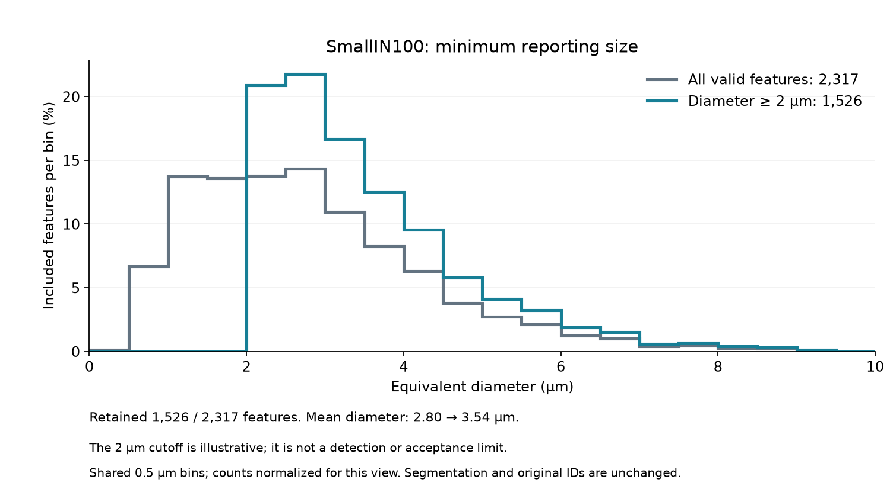

# Small IN100 Minimum Size Comparison

Executable pipeline: `(04) Small IN100 Minimum Size Comparison.d3dpipeline`

> **Before adapting:** This pipeline is configured for SmallIN100. Review its input requirements, assumptions, and parameters before using other data. Do not treat this example as a validated acceptance procedure. Adapt and validate it for the scanner, material, resolution, and quality requirement.

## At a glance

- **Input:** The saved `(02) Small IN100 Feature Measurements` DREAM3D file.
- **Comparison:** All occupied features versus occupied features with equivalent diameter at least 2.0 µm.
- **Result:** A traceable feature CSV and DREAM3D file with masks, separate diameter summaries, and matched histograms.
- **Run order:** Archive -> Feature Preparation -> Feature Measurements -> this branch. See the [quick start](README.md#quick-start-117-section-3d-example).

## Purpose and real-world setting

This illustrative comparison shows how a chosen minimum equivalent diameter changes the reported size distribution. It does not reproduce the published numbers in [Groeber and Jackson (2014), DOI 10.1186/2193-9772-3-5](https://doi.org/10.1186/2193-9772-3-5).

## Rule and data flow

Read `Data/Output/Small_IN100_Examples/Measurements/SmallIN100_FeatureMeasurements.dream3d` once. The input must contain the image geometry `DataContainer`, cell `DataContainer/Cell Data/FeatureIds`, and feature arrays `NumElements` and `EquivalentDiameters` in `DataContainer/Cell Feature Data`. The saved pilot has 2,335 feature rows: background row 0, 2,317 occupied positive-ID rows, and 17 unused positive-ID rows. Background `NumElements[0]` is zero in that checkpoint. Recheck this for other data; add an explicit feature-ID condition if row 0 becomes occupied.

The pipeline writes two Boolean arrays in the feature matrix:

- `ValidFeatures = NumElements > 0`.
- `ReportableFeatures = (NumElements > 0) AND NOT (EquivalentDiameters < 2.0 µm)`.

The filter's supported `<` comparison is inverted to make the `2.0` cutoff **inclusive**. This is an illustrative reporting cutoff. It is not a sensor detection limit or material acceptance threshold. Neither mask changes the cell `FeatureIds`, feature-row IDs, or measured values. The CSV keeps every positive `Feature_ID`, including unused rows, and includes both masks. Use `ValidFeatures=1` or `ReportableFeatures=1` to choose rows; do not infer selection from CSV row count alone. The feature CSV omits background row 0 by the writer's normal behavior.

`AllValidDiameterSummary` and `SelectedDiameterSummary` are separate one-row attribute matrices. Each contains `Length` (feature count), `Minimum`, `Maximum`, `Mean`, `Median`, and `StandardDeviation` of `EquivalentDiameters` in micrometers. The standard deviation uses the population divisor, `N`. `AllValidDiameterHistogram` and `SelectedDiameterHistogram` each contain the filter's `"EquivalentDiameters" Histogram` group with `Bin Counts`, `Bin Ranges`, and `Most Populated Bin`. Both use 20 half-open bins over `[0, 10)` µm, so the counts can be compared directly. The checked baseline's occupied diameters range from 0.4473501 to 9.46694 µm; none are outside that interval. If the selected count is zero, inspect the mask and input before interpreting any summary or distribution.

Row 0 in each **summary matrix** is the one aggregate result for its mask. It is not feature 0 in the feature matrix.

## Outputs and checks

- `Data/Output/Small_IN100_Examples/MinimumSize/SmallIN100_MinimumSize.csv`: all positive feature rows with the explicit masks and original measurements.
- `Data/Output/Small_IN100_Examples/MinimumSize/SmallIN100_MinimumSize.dream3d`: original geometry and `FeatureIds`, new selection arrays, summaries, and histograms.

In the checked Windows in-core Release run, the masks and saved summaries gave:

| Diameter group | Features | Min (µm) | Max (µm) | Mean (µm) | Median (µm) | Population SD (µm) |
| --- | ---: | ---: | ---: | ---: | ---: | ---: |
| All valid | 2,317 | 0.44735 | 9.46694 | 2.79966 | 2.57477 | 1.47703 |
| At least 2.0 µm | 1,526 | 2.00228 | 9.46694 | 3.53953 | 3.20188 | 1.28144 |

The reporting rule excluded 791 valid features. Both saved histogram count sums matched their summary counts. The preview divides each group's bin counts by its feature count; the saved DREAM3D histograms store counts. It is not evidence of native GUI rendering.

After changing voxel spacing or units, rerun Feature Measurements before this branch because it reads stored sizes. If a selected summary has `Length=0`, treat its other values as placeholders and leave its histogram unnormalized. Running pipelines 03 and 04 in sequence does not combine their masks; use an explicit AND condition when both selection rules are needed.

Compare each summary `Length` with the count of its mask's true positive-ID rows. Check that selected IDs are a subset of valid IDs and that a feature with diameter exactly 2.0 µm is selected. Both histogram count sums should match their summary lengths. The difference between the two lengths is the number below the reporting cutoff. This rule does not address surface truncation; the surface comparison is a separate branch.

For another volume, check physical units, spacing, the meaning of background 0, feature-matrix row indexing, the scientific basis for a reporting cutoff, and the `[0, 10)` µm histogram coverage. Adjust both histogram ranges together when needed. This is an **illustrative** subset of the Small IN100 workflow discussed by [Groeber and Jackson (2014)](https://doi.org/10.1186/2193-9772-3-5), not a reproduction of its published numbers. In the checked run, independent NumPy checks matched both masks, all six statistics in each summary, histogram counts and edges, original `FeatureIds` and baseline feature arrays, and all 18 numeric CSV columns. The exact 2.0 µm equality case is supported by the filter's inverted strict comparison but was not present among selected values in this fixture. OOC, generated Python, and native GUI behavior remain unverified.
