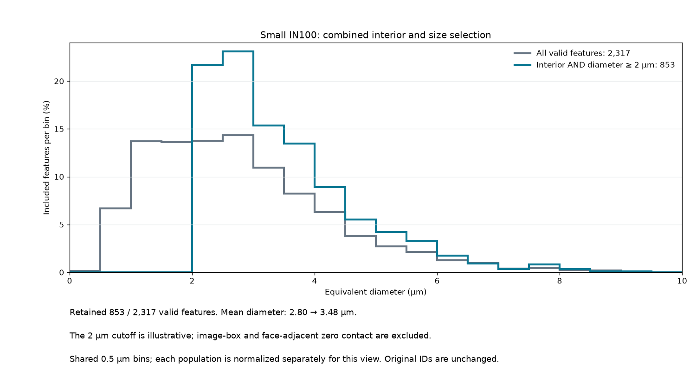

# Small IN100 Combined Selection

Executable pipeline: `(05) Small IN100 Combined Selection.d3dpipeline`

> **Before adapting:** This pipeline is configured for SmallIN100. Review its input requirements, assumptions, and parameters before using other data. Do not treat this example as a validated acceptance procedure. Adapt and validate it for the scanner, material, resolution, and quality requirement.

## At a glance

- **Input:** The saved `(02) Small IN100 Feature Measurements` DREAM3D file.
- **Selection:** Occupied features that have no image-box or face-adjacent background contact **and** have equivalent diameter at least 2.0 µm.
- **Result:** A traceable feature CSV and DREAM3D file with Boolean masks, separate diameter summaries, and matched histograms.
- **Run order:** Archive → Feature Preparation → Feature Measurements → this branch. See the [quick start](README.md#quick-start-117-section-3d-example).

## Purpose and real-world setting

This illustrative comparison shows how two explicit feature-selection rules change the reported equivalent-diameter distribution. Running the separate surface and minimum-size pipelines in sequence does not intersect their masks: each reads the measurement checkpoint. This pipeline applies both conditions in one selection. It does not reproduce the published results of [Groeber and Jackson (2014), DOI 10.1186/2193-9772-3-5](https://doi.org/10.1186/2193-9772-3-5).

## Rule and data flow

Read `Data/Output/Small_IN100_Examples/Measurements/SmallIN100_FeatureMeasurements.dream3d` once. The input must contain image geometry `DataContainer`, cell array `DataContainer/Cell Data/FeatureIds`, and feature arrays `NumElements` and `EquivalentDiameters` in `DataContainer/Cell Feature Data`. The saved pilot has 2,335 feature rows: background row 0, 2,317 occupied positive-ID rows, and 17 unused positive-ID rows. Background `NumElements[0]` is zero in that checkpoint. For another volume, recheck this convention; an occupied row 0 needs an explicit feature-ID condition.

`ComputeSurfaceFeatures` marks features touching the image box or face-adjacent feature 0, with `mark_feature_0_neighbors=true`. The pipeline then writes two Boolean arrays in the feature matrix:

- `ValidFeatures = NumElements > 0`.
- `CombinedFeatures = (NumElements > 0) AND (SurfaceFeatures == 0) AND NOT (EquivalentDiameters < 2.0 µm)`.

All three threshold leaves use AND. Only the strict less-than leaf is inverted, so the 2.0 µm cutoff is **inclusive**. This reporting cutoff is illustrative; it is not an instrument detection threshold or a material acceptance limit. The masks do not change cell `FeatureIds`, feature-row IDs, or measured arrays. The CSV retains every positive `Feature_ID`, including unused rows; use `CombinedFeatures=1` to select rows rather than inferring selection from CSV row count. The feature CSV omits background row 0 by the writer's normal behavior.

`AllValidDiameterSummary` and `SelectedDiameterSummary` are separate one-row matrices. Each has `Length`, `Minimum`, `Maximum`, `Mean`, `Median`, and `StandardDeviation` for `EquivalentDiameters` in micrometers; standard deviation uses the population divisor `N`. The summary's row 0 is one aggregate result, not background feature 0. `AllValidDiameterHistogram` and `SelectedDiameterHistogram` use the same 20 half-open bins over `[0, 10)` µm. Saved histograms contain counts. Values outside this fixed range are not counted, so check coverage before comparing histograms. In the checked measurement checkpoint, occupied diameters span 0.4473501 to 9.46694 µm. If no features pass the combined rule, inspect the input and mask; do not interpret placeholder summary fields or normalize a zero-count histogram.

## Outputs and checks

- `Data/Output/Small_IN100_Examples/CombinedSelection/SmallIN100_CombinedSelection.csv`: all positive feature rows with `ValidFeatures`, `SurfaceFeatures`, `CombinedFeatures`, and original measurements.
- `Data/Output/Small_IN100_Examples/CombinedSelection/SmallIN100_CombinedSelection.dream3d`: original geometry and `FeatureIds`, new masks, summary matrices, and histograms.

In the checked Windows in-core Release run, independent reconstruction from cell labels and saved diameters gave:

| Diameter group | Features | Min (µm) | Max (µm) | Mean (µm) | Median (µm) | Population SD (µm) |
| --- | ---: | ---: | ---: | ---: | ---: | ---: |
| All valid | 2,317 | 0.44735 | 9.46694 | 2.79966 | 2.57477 | 1.47703 |
| Combined selection | 853 | 2.00228 | 9.03072 | 3.47576 | 3.13651 | 1.23245 |

The surface rule selected 1,349 of the valid features, and the size rule selected 1,526; their intersection has 853. Both saved histogram count sums equal their population counts. The preview uses verified saved counts divided by each population's own feature count; the DREAM3D file stores counts. It is an annotated data plot, not native GUI rendering.

The selected IDs should equal the intersection of the independently checked surface and minimum-size rules. Compare each summary `Length` with its mask's true positive-ID row count, verify selected IDs are a subset of valid IDs, and verify both histogram sums match their summary lengths when all selected diameters lie in `[0, 10)` µm. Feature rows with `NumElements=0`, including background and unused positive IDs, must have false masks. When adapting to another volume, review voxel spacing and physical units, whether feature 0 denotes background, the scientific basis for both rules, and the shared histogram range. Rerun Feature Measurements after changing spacing or units because this branch reads stored sizes.

This is an **illustrative** subset of the public Small IN100 workflow. The [public archive](https://www.dream3d.io/Data_Archive/Small_IN100.tar.gz) contains 117 ANG sections attributed by the [official tutorial](https://dream3d.bluequartz.net/Help/2_Tutorials/EBSDReconstruction/) to M. Uchic and colleagues at AFRL. Archive identity with the paper's processed supplement has not been proven. No raw or processed volume is bundled. The combined branch passed isolated preflight/execution and independent mask, summary, histogram, original-array, and CSV checks. A validation-only 20 µm cutoff produced an empty selection with zero count and histogram; the baseline has no exact 2.0 µm feature, so runtime equality at the cutoff was not exercised. Source threshold semantics and a logic check support the inclusive rule. `PythonGeneration.yaml` specifies generation; Python generation and execution have not been verified. OOC and native GUI behavior remain unverified.
