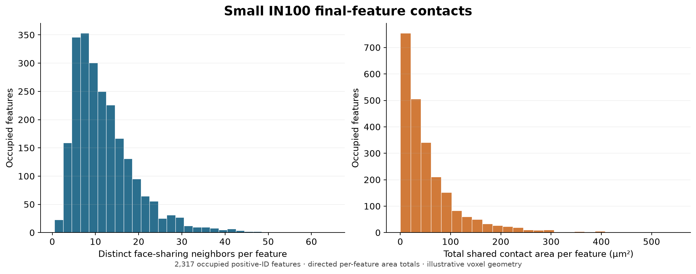

# Small IN100 Neighbor Relationships

Executable pipeline: `(06) Small IN100 Neighbor Relationships.d3dpipeline`

> **Before adapting:** This pipeline is configured for SmallIN100. Review its input requirements, assumptions, units, and parameters before using other data. Do not treat this example as a validated acceptance procedure. Adapt and validate it for the scanner, material, resolution, and quality requirement.

## At a glance

- **Input:** The saved `(02) Small IN100 Feature Measurements` DREAM3D file.
- **Question:** Which final positive-ID features share voxel faces, and how much area does each pair share?
- **Result:** A full reciprocal contact graph in DREAM3D and a scalar per-feature CSV.
- **Run order:** Archive -> [Feature Preparation](%2801%29%20Small%20IN100%20Feature%20Preparation.md) -> [Feature Measurements](%2802%29%20Small%20IN100%20Feature%20Measurements.md) -> this branch. See the [quick start](README.md#quick-start-117-section-3d-example).

## Purpose and real-world setting

Feature size and shape do not show which segmented regions touch. This illustrative branch adds a contact graph to the same measured checkpoint so a reader can inspect connectivity and shared contact area without changing labels or repeating segmentation. It does not reproduce the published numbers in [Groeber and Jackson (2014), DOI 10.1186/2193-9772-3-5](https://doi.org/10.1186/2193-9772-3-5).

## Contact rule and units

`ComputeFeatureNeighbors` uses the final `DataContainer/Cell Data/FeatureIds`. Two different positive IDs are neighbors when their cells share at least one face. Background ID 0, exterior faces, edge-only contact, and corner-only contact are excluded as graph endpoints. This branch does not wrap opposite image faces or use twin `ParentIds`. Its contacts differ from the temporary neighbors used during cleanup in pipeline 01.

Each neighbor list is sorted by ID. `NeighborList` and `SharedSurfaceAreaList` align row by row: an area belongs to the neighbor at the same position. Every undirected pair appears once in each endpoint's row with equal area. For one feature, `TotalSharedArea` already sums all its contacts and needs no halving. Across the whole sample, divide the sum of feature totals by two to count each shared interface once.

The area is a voxel-face estimate in the geometry length unit squared. This checkpoint has 0.25 µm spacing in X, Y, and Z, so every shared face contributes 0.0625 µm². With anisotropic spacing `(dx, dy, dz)`, faces normal to X, Y, and Z contribute `dy*dz`, `dx*dz`, and `dx*dy`, respectively. These are physical contact areas, not dimensionless face counts or smooth grain-boundary estimates. Resolution, segmentation, and image truncation affect them.

`GeometrySurfaceFeatures` marks features touching the finite image box. Pipeline [03's surface comparison](%2803%29%20Small%20IN100%20Surface%20Selection%20Comparison.md) uses a broader `ComputeSurfaceFeatures` rule that also marks face-adjacent background contact. Do not substitute these flags when selecting interior features.

## Outputs and interpretation

`ComputeNeighborListStatistics` writes `SharedAreaListLength`, `MeanSharedArea`, `LargestSharedArea`, and `TotalSharedArea` for each feature. Length should equal `NumNeighbors`. The mean is the unweighted arithmetic mean of one feature's distinct neighbor areas; it is not a global area-weighted grain statistic. An empty list gives zero scalar reductions, so use `NumElements>0` before interpreting a distribution.

- `Data/Output/Small_IN100_Examples/NeighborRelationships/SmallIN100_NeighborRelationships.csv` contains scalar feature data with `Feature_ID` rows. It omits background row 0 but retains unused positive rows. Neighbor-list export is disabled to keep this table rectangular.
- `Data/Output/Small_IN100_Examples/NeighborRelationships/SmallIN100_NeighborRelationships.dream3d` contains both complete neighbor lists, physical areas, scalar reductions, geometry, labels, and original measurements. XDMF export is disabled.

The plot below shows the degree and total shared-area distributions for occupied positive-ID features from the checked SmallIN100 run. It is a data-derived preview, not evidence of native GUI rendering.

The checked fixture has 2,317 occupied positive rows and 17 unused positive rows. Its contact graph has 14,003 unique pairs and 28,006 directed entries. The unique shared area is 66,156.4375 µm²; summing all feature totals gives twice that value. Occupied degrees range from 1 to 64. The `GeometrySurfaceFeatures` image-box flag marks 448 positive-ID features. These values belong to this input and must be recomputed for another volume.

For the checked Windows in-core Release branch, isolated preflight and execution passed. An independent axis-pair scan of the input labels and spacing matched every saved neighbor ID, packed-list count, shared area, scalar reduction, and image-box flag. Original arrays and geometry were unchanged, and scalar CSV rows matched the saved DREAM3D arrays. An altered-spacing validation case checked the three distinct perpendicular face areas; it did not remeasure the existing physical feature arrays. OOC, generated Python, native GUI behavior, and human interpretation review remain unverified.
