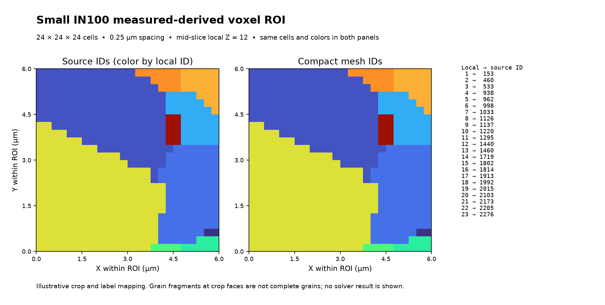

# Small IN100 Bounded Voxel Mesh

Executable pipeline: `(07) Small IN100 Bounded Voxel Mesh.d3dpipeline`

> **Before adapting:** This pipeline is configured for SmallIN100. Review its input requirements, assumptions, units, and parameters before using other data. Do not treat this example as a validated acceptance procedure. Adapt and validate it for the scanner, material, resolution, and quality requirement.

## At a glance

- **Input:** The saved `(01) Small IN100 Feature Preparation` DREAM3D checkpoint, before whole-volume feature measurements.
- **Question:** How can a bounded measured voxel region become a traceable C3D8 mesh with dense local grain labels?
- **Result:** A cropped DREAM3D file with both original and compact cell IDs, plus five Abaqus `.inp` files under `VoxelMesh/`.
- **Run order:** Archive -> [Feature Preparation](%2801%29%20Small%20IN100%20Feature%20Preparation.md) -> this branch. [Feature Measurements](%2802%29%20Small%20IN100%20Feature%20Measurements.md) is not a prerequisite. See the [quick start](README.md#quick-start-117-section-3d-example).

## Purpose and real-world setting

A voxel mesh is one possible starting point for a grain-resolved mechanical model. This **illustrative** example selects a small measured Small IN100 region, preserves each cell's original feature ID, compacts a second ID array for local grain sets, and writes a connected hexahedral grid. It demonstrates **mesh/model-input scaffolding**, not a complete mechanical simulation. The exported sections reference `Grain_Mat1` through `Grain_Mat23`, but no material definitions, loads, boundary conditions, or solver settings are supplied. No Abaqus execution was verified.

[Agius et al. (2022)](https://doi.org/10.1016/j.mex.2022.101763) describe a synthetic voxel RVE workflow with later Python and Fortran stages to calculate slip-system-dependent quantities. This example instead crops a separate measured Small IN100 reconstruction. It does not reproduce their slip distances, run LengMorph, or establish compatibility with its Python file consumer.

## Input and crop assumptions

Read `Data/Output/Small_IN100_Examples/Preparation/SmallIN100_Features.dream3d`. Its `DataContainer/Cell Feature Data` matrix has rows but no child measurement arrays. This choice prevents whole-volume feature volumes, diameters, centroids, or shapes from being retained as if they described the truncated ROI grains. The preparation file remains the source input and is not overwritten.

The checked input has XYZ dimensions `189 × 201 × 117`, spacing `0.25 × 0.25 × 0.25 µm`, and a small nonzero source-origin offset. The inclusive XYZ voxel bounds are `[82, 88, 46]` through `[105, 111, 69]`. Each axis therefore contains 24 cells. HDF5 cell arrays store axes in ZYX order: an independent Python/h5py source slice is `[46:70, 88:112, 82:106]`. The cropped origin shifts by the minimum voxel indices times spacing; do not replace the source offset with zero. For the checked input it is approximately `[20.5000038, 22.0, 11.4999962] µm`, and the crop spans `6 × 6 × 6 µm`.

The selected current slice contains 23 positive original IDs and no background cells. That is an observation of this checkpoint, not a guarantee for a changed input. The writer meshes **zero/background voxels too**. A background-free ROI was chosen deliberately, but it is not statistically representative. Several grains terminate at crop faces; those fragments are not complete original grain shapes.

## Data flow and filter settings

1. `ReadDREAM3D` imports the preparation checkpoint once.
2. `CopyDataObject` deep-copies cell `FeatureIds` to the same parent using suffix `_Original`, creating `FeatureIds_Original` before the crop.
3. `CropImageGeometry` uses **voxel**, not physical, bounds; enables X/Y/Z; crops in place; and renumbers the selected `FeatureIds` against `Cell Feature Data`. Every retained cell array, including `FeatureIds_Original`, is sliced. Only selected `FeatureIds` is compacted. The checked original IDs, sorted ascending, map one-to-one to compact IDs `1..23`; feature row 0 remains, giving 24 rows.
4. `WriteAbaqusHexahedron` writes `DataContainer` with compact cell `FeatureIds`. It writes one C3D8 element per cell and shared grid nodes, with no dummy node. The job name is `SmallIN100_ROI24_illustrative`. Its `hourglass_stiffness=250` is the writer's default illustrative file parameter; it is **not** a calibrated or recommended material parameter.
5. `WriteDREAM3D` saves `SmallIN100_MeshROI.dream3d` with compression enabled and XDMF disabled.

Create `Data/Output/Small_IN100_Examples/VoxelMesh/` in the chosen CLI working folder **before preflight**. The Abaqus writer rejects a missing output directory. All six outputs stay in this folder:

- `SmallIN100_ROI24.inp` includes the four companion files.
- `SmallIN100_ROI24_nodes.inp` contains 15,625 one-based grid nodes for the checked 24³ ROI.
- `SmallIN100_ROI24_elems.inp` contains 13,824 one-based C3D8 elements.
- `SmallIN100_ROI24_elset.inp` contains the whole `cube` set and positive compact `Grain1_set` through `Grain23_set`.
- `SmallIN100_ROI24_sects.inp` assigns grain-section material references; it does not define the materials.
- `SmallIN100_MeshROI.dream3d` contains the bounded geometry and both label arrays.

Node coordinates are in **micrometers** because the source geometry uses micrometers. An Abaqus input file does not enforce a unit system automatically. Any material, load, and boundary-condition values added later must use a consistent unit system.

The preview compares the same interior Z slice in the two saved arrays and labels the ROI extent. It is neither a solver result nor native GUI rendering. Counts, label IDs, and geometry describe the checked input only.

In a checked Windows in-core Release run, isolated preflight and execution passed, the registered seven-example chain passed, and independent checks matched the source crop, label mapping, and every node, element, grain set, and section reference. The flat runtime and staged-install copies matched the source suite. OOC, generated Python execution, native GUI behavior, Abaqus solving, and LengMorph consumption remain unverified.

## Adaptation and quality checks

For another ROI, choose inclusive XYZ voxel bounds within the prepared geometry, then recompute the ZYX HDF5 slice and positive original-ID set. Inspect background occupancy, boundaries, and grain fragments. Decide whether truncated regions, resolution, physical extent, and available boundary conditions suit the intended analysis; a matching grain count or box size alone cannot validate suitability. Check the original-to-compact mapping cell by cell, rather than assuming the current `1..23` mapping. The feature matrix is only an ID-indexed container here; compute ROI-specific measurements separately if they are needed.

Before using the mesh in a model, independently check node coordinates and units, all element corners and positive volumes, complete element coverage, unique grain-set membership, section/material references, and the required model definitions. A changed ROI with background cells requires an explicit decision about those meshed cells. The five files here establish no Abaqus solver compatibility or LengMorph Python-consumer compatibility.

## Scientific basis and provenance

The [public Small_IN100 archive](https://www.dream3d.io/Data_Archive/Small_IN100.tar.gz) supplies 117 measured ANG sections used by the archive and preparation predecessors. The [Groeber and Jackson DREAM.3D article](https://doi.org/10.1186/2193-9772-3-5) provides reconstruction context. [Agius et al.](https://doi.org/10.1016/j.mex.2022.101763) provide the distinct voxel-RVE export context. The Agius paper is CC BY 4.0; that does not establish redistribution rights for the separate Small IN100 archive. No raw or processed volume is bundled here. The PNG is derived from the locally checked output.

The reproduction status is **illustrative**. The paper describes a synthetic voxel RVE workflow; the linked [author example recipe](https://github.com/DylanAgius/LengMorph/blob/main/Additional%20Files/Dream3d%20files/example_supp.json) specifies a 10 × 10 × 10 voxel realization. Its grain-boundary Python matrices, Fortran calculations, and slip-distance results are outside this pipeline. The `.d3dpipeline` is the executable authority when narrative text and arguments differ.

The [YAML sidecar](%2807%29%20Small%20IN100%20Bounded%20Voxel%20Mesh.yaml) records the archive SHA-512, checked preparation and ROI-slice SHA-256 values, and all six local output SHA-256 values. These identities describe the checked fixture; derive them again after regeneration.

## Guidance for an LLM or MCP assistant

Keep the preparation checkpoint as input. Explain inclusive XYZ selection separately from ZYX array storage. Preserve both label arrays and derive mapping from actual saved data after any change. Create the output directory before preflight. Describe the `.inp` files as mesh/model-input scaffolding until materials, constraints, loads, unit consistency, and solver behavior are checked separately. Do not infer complete grain morphology, statistical representativeness, paper reproduction, or LengMorph compatibility from a successful export.
