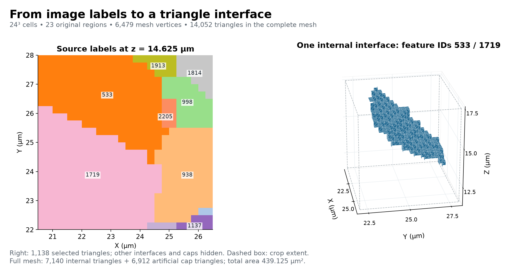

# Small IN100 Surface Mesh

Executable pipeline: `(01) Small IN100 Surface Mesh.d3dpipeline`

> **Before adapting:** Do not treat this example as a validated acceptance procedure. Adapt and validate it for the scanner, material, resolution, and quality requirement. Check crop bounds, source feature labels, and coordinate units. The Small IN100 crop contains truncated grains and artificial caps; the combined interface network is not a certified closed-manifold or solver-ready mesh.

## At a glance

| Item | Contract |
| --- | --- |
| Prerequisite | Small IN100 archive, then the feature-preparation pipeline in `Small_IN100_Examples` |
| Input | `Data/Output/Small_IN100_Examples/Preparation/SmallIN100_Features.dream3d` |
| Region | Inclusive XYZ indices `[82,88,46]` through `[105,111,69]`; 24 cells per axis |
| Mesh | `SurfaceMesh`, with `Face Data/FaceLabels`, `FaceAreas`, `FaceNormals`, and `Vertex Data/NodeTypes` |
| Output | `Data/Output/Small_IN100_Geometry_Examples/Surface/SmallIN100_SurfaceMesh.dream3d` |
| Status | Illustrative modern workflow; no paper-result equivalence or solver certification |

## Purpose and real-world setting

A segmented EBSD volume identifies which grain owns each voxel, but a surface representation makes interfaces easier to inspect and pass to geometry tools. This example converts a small, measured-derived region of the Small IN100 nickel-based superalloy reconstruction into a multi-material triangle mesh. It preserves the original grain labels so a selected face can be traced back to the reconstruction. Use it to learn the transition from labeled image cells to shared interfaces before processing a larger volume.

## Input data and assumptions

The preparation checkpoint comes from 117 serial EBSD sections, with a 189 by 201 cell section size and numerical spacing 0.25 on all three axes. The source ImageGeom records Micrometer units. The pipeline explicitly constructs the final triangle geometry with those same units because SurfaceNets does not propagate them and otherwise retains default Meter metadata. Coordinates are copied without rescaling.

The chosen crop occupies a six-coordinate-unit cube. It contains grain fragments wherever a label reaches a crop face. `FeatureIds` are the segmentation labels; `ParentIds` describe a different, twin-grouping relationship and are not used for meshing. Start from preparation, whose feature matrix has no whole-volume measurements. A measurement checkpoint could attach misleading full-grain volumes or centroids to cropped fragments.

## Data flow and filter choices

Read preparation → crop image in place → SurfaceNets without relaxation → construct micrometer mesh and copy ownership arrays → remove temporary mesh → triangle areas → triangle normals → save.

| Filter and choice | Why it is here | Alternatives and pitfalls |
| --- | --- | --- |
| `ReadDREAM3DFilter` | Reuse the reconstructed and cleaned segmentation | A raw ANG stack still needs reconstruction and feature segmentation |
| `CropImageGeometryFilter`, no renumbering | Bound memory and crop every cell array while retaining original label identity | A new output geometry retains a whole-volume copy; renumbering loses direct source-ID correspondence unless mapped |
| `SurfaceNetsFilter`, smoothing off | Establish a reproducible multi-label baseline before altering vertices | M3C uses a different meshing method; deprecated QuickMesh is not the recommended default |
| Bounding-box skin index 0 | Keep all artificial crop caps visible and identifiable | Background-backed wall removal is not a general exterior-skin removal command |
| Winding repair enabled | Attempt to make local face ordering consistent | Repair is not proof of manifoldness, watertightness, or globally outward normals |
| `CreateGeometryFilter` and ownership copies | Copy vertices and triangles with Micrometer units, then copy FaceLabels and NodeTypes into matching matrices | Array sizes come from the mesh; no fixed face count, rescaling, or remeshing is used. Delete the temporary geometry before saving |
| Areas and normals | Attach current per-face geometry measurements | Whole-mesh area includes grain interfaces and caps, not simply specimen surface area |
| `WriteDREAM3DFilter` | Preserve labels, arrays, and both image and mesh geometry | An STL alone loses this scientific context |

The crop is in place, with inclusive upper bounds. Subtracting endpoints without adding one would incorrectly suggest 23 cells per axis. SurfaceNets transfers no optional cell or feature arrays; this keeps the first lesson focused on geometry and label ownership. Node types distinguish ordinary interface nodes, junctions, and crop-boundary nodes. Face labels store two owners; `-1` denotes the padded exterior, while `0` would remain background if present in an adapted input.

## Outputs and interpretation

The checked crop contains 23 positive source IDs and no background cells. Its mesh has 6,479 vertices and 14,052 triangles: 7,140 internal-interface triangles and 6,912 artificial cap triangles. Total area is 439.125 µm², counting each mesh triangle once. All saved mesh geometry explicitly records Micrometer units.

The figure pairs a source section at z = 14.625 µm with the 1,138-triangle interface between IDs 533 and 1719. Other interfaces and caps are hidden in that 3D panel. Slice colors are categorical, with IDs annotated on larger regions. Normals follow triangle winding; “outward” needs a specified owner.

The combined mesh is a network of internal interfaces plus crop caps. At junctions, more than two sheets can meet. It is not a single closed-manifold exterior shell, a tetrahedral mesh, or a finite-element model. Keeping caps helps explain how a bounded data volume differs from the physical specimen.

## Adaptation and quality checks

Change bounds only after verifying image dimensions and XYZ ordering. Inspect whether the new crop introduces background, isolates very small fragments, or cuts the feature of interest. Preserve the source labels when traceability matters. Recompute feature-level measurements on an explicitly defined cropped-label contract rather than carrying old whole-volume values forward.

Check that every triangle references valid vertices, face areas are finite and positive, normals have finite unit length, and label pairs belong to the cropped input or exterior. Inspect junctions and the artificial walls visually. Such checks establish useful arithmetic and structural properties but cannot establish self-intersection freedom or suitability for a particular solver. Use the next example to compare relaxation without overwriting this baseline.

## Scientific basis, differences, and extension

[Groeber and Jackson (2014)](https://doi.org/10.1186/2193-9772-3-5) motivate representing reconstructed microstructures as geometric objects and describe the 117-section reconstruction-and-meshing case. This crop and modern SurfaceNets method are illustrative adaptations. The public archive's identity with the publisher's processed volume is not proven. The article is CC BY 2.0; separate raw-archive redistribution rights were not established, and this bundle includes no volume data.

[Frisken (2022)](https://jcgt.org/published/0011/01/03/paper.pdf) explains shared multi-label surfaces and constrained relaxation. Its medical and synthetic cases differ from this alloy. The current implementation's diagonal-area helper does not realize the paper's section 4.4 minimum-area selection, so this example makes no corresponding self-intersection-reduction claim. The paper is CC BY-ND 3.0; its implementation supplement is MIT licensed. No paper figure is redistributed.

To extend the workflow, add a separate measured-quality comparison, a carefully defined interface selection, or a downstream volume mesher with its own validation. See the suite README for run order and source provenance.

## Guidance for an LLM or MCP assistant

Read the `.d3dpipeline` as executable authority. Preserve label names and the preparation prerequisite, explain every changed crop or mesher setting, and regenerate both dependent examples after changing the baseline. Never infer complete grain shape, manifoldness, or an exact paper reproduction from successful execution alone. If input units change, update the explicit geometry-unit choice consistently.
