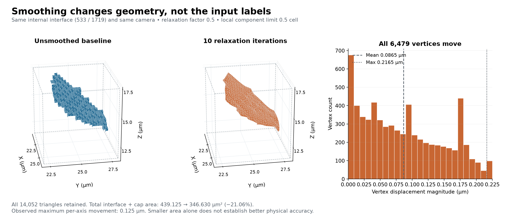

# Small IN100 Surface Smoothing

Executable pipeline: `(02) Small IN100 Surface Smoothing.d3dpipeline`

> **Before adapting:** Do not treat this example as a validated acceptance procedure. Adapt and validate it for the scanner, material, resolution, and quality requirement. Check crop bounds, coordinate scale, and the intended geometric tolerance. The smoothing limit is componentwise in cell coordinates, and a smoother Small IN100 surface is not proof of greater physical accuracy.

## At a glance

| Item | Contract |
| --- | --- |
| Prerequisite | `(01) Small IN100 Surface Mesh.d3dpipeline` |
| Input | `Data/Output/Small_IN100_Geometry_Examples/Surface/SmallIN100_SurfaceMesh.dream3d` |
| Baseline retained | `SurfaceMesh` with its original measurements |
| New mesh | `SmoothedSurfaceMesh` with `SmoothedFaceAreas` and `SmoothedFaceNormals` |
| Relaxation | 10 iterations, factor 0.5, maximum local coordinate displacement 0.5 |
| Output | `Data/Output/Small_IN100_Geometry_Examples/Smoothing/SmallIN100_SurfaceSmoothing.dream3d` |

## Purpose and real-world setting

Surface relaxation can make a voxel-derived grain-boundary representation easier to inspect, but it also changes the measured geometry. A smoother display is not automatically a more accurate physical interface. This example creates a second SurfaceNets mesh from exactly the same cropped Small IN100 labels as the baseline, then saves both versions together. It provides a controlled way to examine how a modest relaxation setting changes vertex positions, triangle areas, and normals while keeping the input segmentation fixed.

## Input data and assumptions

The input must contain the baseline mesh and its 24 by 24 by 24 image crop. Labels remain the original preparation `FeatureIds`; the pipeline neither renumbers them nor uses twin `ParentIds`. All source cell arrays have already been cropped. The predecessor's empty feature-measurement matrix avoids confusing a cropped fragment with the complete reconstructed grain.

The numerical spacing is isotropic 0.25 micrometers. The final smoothed geometry explicitly records Micrometer units, matching the baseline and image. The relaxation setting described below is dimensionless in the implementation, so it must not be read directly as 0.5 micrometers. This distinction matters even when a help-page description uses physical-length wording.

## Data flow and filter choices

Read baseline and crop → regenerate a temporary smoothed SurfaceNets mesh → construct the micrometer mesh and copy ownership arrays → remove temporary mesh → compute fresh areas and normals → save both meshes.

| Filter and choice | Why it is here | Alternatives and pitfalls |
| --- | --- | --- |
| `ReadDREAM3DFilter` | Bring the exact baseline and cropped labels into one comparison | Reading a separately recropped volume can mix a segmentation change with a smoothing change |
| `SurfaceNetsFilter`, smoothing enabled | Apply the mesher's built-in, junction-aware relaxation | A separate post-mesh smoothing filter has different constraints and needs its own comparison |
| 10 iterations, factor 0.5 | Use a modest, explicit teaching choice | More passes or a larger factor are not evidence of better physical accuracy |
| Maximum distance 0.5 | Bound each local coordinate around its original cell center | This is neither a physical-distance parameter nor a Euclidean-radius bound |
| Skin index 0, winding repair enabled | Keep the same boundary and winding choices as the baseline | Changing skin settings would confound the comparison |
| `CreateGeometryFilter` and ownership copies | Reconstruct the published triangle geometry with Micrometer units and unchanged arrays | SurfaceNets otherwise leaves default Meter metadata. Copy current vertices, triangles, FaceLabels, and NodeTypes, then delete the temporary mesh |
| Areas and normals | Measure the new vertices under distinct names | Reusing copied baseline normals would attach directions to the wrong surface |
| `WriteDREAM3DFilter` | Preserve the image, unsmoothed baseline, and new mesh together | Exporting only the smoothed geometry removes the reference needed for comparison |

The current implementation averages face-connected neighbors and treats junction vertices using junction-face neighbors. It then clamps each local coordinate to `0.5 +/- max_distance_from_voxel`. With the chosen value, the local interval is `[0,1]`. After multiplication by spacing, the bound is 0.125 micrometers per coordinate relative to the unsmoothed position. The corresponding three-dimensional displacement can reach the square root of three times that bound, about 0.217 micrometers. This bound follows from the settings; the observed displacements are reported below. It is not an accuracy estimate against the unknown physical boundary.

## Outputs and interpretation

The figure compares the same 533/1719 interface under the same camera; its histogram uses all 6,479 mesh vertices. Every vertex moves: mean displacement is 0.0865 µm, maximum magnitude is 0.2165 µm, and maximum movement on each axis is 0.125 µm. All 14,052 triangles, face labels, and node types are retained. The cropped image and baseline remain unchanged.

Total interface-plus-cap area falls from 439.125 to 346.630 µm², a 21.06% reduction. The smallest triangle falls from 0.03125 to approximately 0.00000534 µm²: inspect very small faces before further modeling. Reduced area and smoother appearance do not establish greater physical accuracy or better element quality. Separate internal interfaces from artificial caps when interpreting area. Boundary node flags do not mean those vertices remain fixed.

## Adaptation and quality checks

Change one relaxation parameter at a time and retain the baseline. Check finite coordinates, valid triangle indices, positive areas, and finite unit normals. Compare displacements in both physical and spacing-normalized coordinates. Confirm the positive label set remains traceable and inspect thin fragments, junctions, and crop walls. Keep a record of the chosen settings with each output so later measurements can be associated with the correct surface.

For anisotropic inputs, a half-cell constraint produces different physical bounds on different axes. A uniform millimeter or micrometer tolerance would therefore require deliberate parameter interpretation and independent checking. Do not silently substitute one scalar physical tolerance for the implemented componentwise clamp. Before using a relaxed mesh for further modeling, separately assess intersections, topology, feature preservation, and the downstream mesher's requirements.

## Scientific basis, differences, and extension

[Groeber and Jackson (2014)](https://doi.org/10.1186/2193-9772-3-5) provide the reconstruction and geometric-representation context. This small crop and current filters do not reproduce their complete workflow or a named mesh result. The measured public archive is a separate source whose exact identity with publisher outputs is unproven. The article is CC BY 2.0; raw archive redistribution rights were not established, and no volume is bundled.

[Frisken (2022)](https://jcgt.org/published/0011/01/03/paper.pdf), especially sections 3.2 and 4.2 and Figure 9, explains the smoothness-versus-fidelity tradeoff. The selected settings are teaching values, not that paper's calibrated alloy settings; its examples concern medical and synthetic volumes. Its section 4.4 diagonal-minimization method is not established by the current area helper, so surface-intersection reduction is not claimed. The article is CC BY-ND 3.0 and the source supplement is MIT licensed.

Extend this lesson with several explicitly named relaxation settings and a material-specific reference or acceptance criterion. Save each result separately and compare an intended measurement, not only visual attractiveness.

## Guidance for an LLM or MCP assistant

Keep the baseline prerequisite and distinguish physical coordinates from local smoothing parameters. Explain any proposed setting change, preserve the input label namespace, and consult the executable arguments first. Never promise volume preservation, complete-grain morphology, closed-manifold topology, or a validated physical boundary based on the smoother preview.
