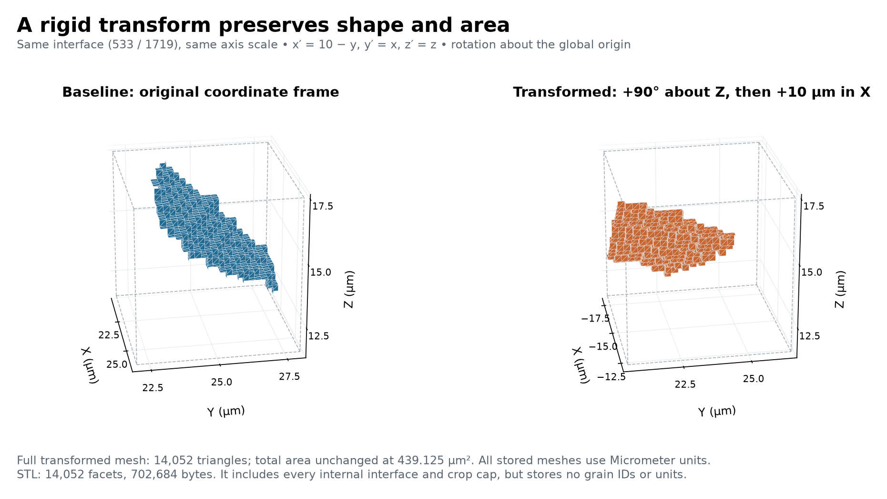

# Small IN100 Surface Transform and Export

Executable pipeline: `(03) Small IN100 Surface Transform and Export.d3dpipeline`

> **Before adapting:** Do not treat this example as a validated acceptance procedure. Adapt and validate it for the scanner, material, resolution, and quality requirement. Check the coordinate frame, pivot, and unit scale before changing the Small IN100 transform. The single STL includes internal interfaces and artificial caps and carries no grain labels or explicit length units.

## At a glance

| Item | Contract |
| --- | --- |
| Prerequisite | `(01) Small IN100 Surface Mesh.d3dpipeline`; smoothing is not required |
| Input | `Data/Output/Small_IN100_Geometry_Examples/Surface/SmallIN100_SurfaceMesh.dream3d` |
| New geometry | `SurfaceMesh_Transformed`; original `SurfaceMesh` is retained |
| Transform | Positive 90-degree Z rotation about the global origin, then translation `[10,0,0]` |
| Coordinate mapping | `x_new = 10 - y`, `y_new = x`, `z_new = z` |
| Output directory | `Data/Output/Small_IN100_Geometry_Examples/Transform/` |

## Purpose and real-world setting

Geometry exchanged between characterization and modeling tools often needs an explicit coordinate transform. A rotation and translation can be simple mathematically while still producing misleading data if old face normals are retained or the receiving tool assumes different units. This example copies the unsmoothed Small IN100 mesh, applies a known rigid transform, recomputes geometric measurements, and writes a single STL. It keeps the labeled DREAM3D data beside that export so label ownership and the transformation remain available for inspection.

## Input data and assumptions

The mesh contains shared internal grain interfaces and artificial caps from a 24-cubed image crop. `FaceLabels` use the original preparation feature IDs and `-1` for the exterior. These labels identify the same owners after the geometry moves. Neither the source image nor the baseline mesh is transformed. This separation makes the before-and-after coordinate relationship visible and avoids accidentally changing the input segmentation.

The baseline mesh explicitly records Micrometer units, matching its image coordinates. The pipeline constructs the transformed geometry from copied baseline vertices and triangles with an explicit Micrometer setting, because a geometry deep copy resets units to Meter. Therefore the translation is ten micrometers, not ten voxels. STL cannot communicate an explicit unit system, so the recipient must be told the coordinate scale and frame.

## Data flow and filter choices

Read baseline → construct micrometer geometry from copied vertices and triangles → copy ownership arrays → transform vertices → compute new areas and normals → write STL → save labeled checkpoint.

| Filter and choice | Why it is here | Alternatives and pitfalls |
| --- | --- | --- |
| `CreateGeometryFilter`, Triangle/Copy/Micrometer | Construct `SurfaceMesh_Transformed` from the baseline vertices and triangles with explicit units | Whole-geometry deep copy resets unit metadata; new attribute matrices avoid stale copied areas and normals |
| `CopyDataObjectFilter`, new parents | Copy FaceLabels and NodeTypes into the new face and vertex matrices | Keep the original SurfaceMesh unchanged and copy no baseline measurements |
| `ApplyTransformationToGeometryFilter`, manual matrix index 2 | Specify rotation and translation in one unambiguous operation | Separate transforms are order-dependent; a different pivot changes the result |
| Translate-to-origin false | Rotate about the actual global origin without recentering | Center-based rotation is a different transformation |
| Save transform matrix true | Retain `SurfaceTransformMatrix` as a numeric record | A prose statement alone is weaker provenance |
| Areas and normals | Create `TransformedFaceAreas` and `TransformedFaceNormals` from current vertices | A copied attribute is not automatically transformed with geometry |
| `WriteStlFileFilter`, grouping index 2 | Write the entire transformed mesh to one binary STL | Feature grouping creates a different set of files and does not solve label preservation |

The homogeneous matrix is:

```text
 0 -1  0 10
 1  0  0  0
 0  0  1  0
 0  0  0  1
```

It acts on column coordinates as rotation followed by translation. This is a rigid transform with determinant one: it preserves lengths and areas and does not reverse handedness. The interpolation choice is inactive for this triangle geometry; no image resampling occurs. The separately displayed rotation, translation, and scale controls are inactive because manual-matrix mode is selected.

## Outputs and interpretation



`SmallIN100_SurfaceTransform.dream3d` retains the crop, baseline, transformed mesh, ownership arrays, fresh measurements, and matrix. Both meshes contain 6,479 vertices and 14,052 triangles and explicitly record Micrometer units. The prescribed coordinate mapping and rotated normals agree with every saved value; triangle areas remain unchanged, totaling 439.125 µm².

The figure shows only the 533/1719 interface, with equal axis scale and absolute coordinates. The binary STL contains the complete mesh: 14,052 facets in 702,684 bytes, including internal interfaces and artificial caps. Its facet coordinates match the transformed geometry. It is not an exterior-only specimen surface.

The STL's facet records contain triangle coordinates and normals, but not the scientific `FaceLabels`, `NodeTypes`, or a declared length unit. Keep the DREAM3D checkpoint as the labeled reference. The STL writer calculates facet normals from the exported vertices; the newly calculated DREAM3D normals remain useful for comparison and other downstream filters. A successful export does not establish a closed manifold, freedom from intersections, or readiness for printing or simulation.

## Adaptation and quality checks

Check the coordinate equation on multiple vertices, including extrema. Compare corresponding face areas before and after transformation within floating-point tolerance. For normals, use `n_new = Rz(90 degrees) n`; translation has no effect on direction. Verify labels, node types, and connectivity are preserved, and check that the binary STL's facet count and coordinates agree with the saved transformed mesh.

When adapting the transform, specify the input frame, output frame, pivot, matrix order, and coordinate units before changing numbers. Nonuniform scaling needs different interpretation: areas change, and normals do not transform like position vectors. Recomputing normals remains appropriate, but this rigid-transform example does not validate arbitrary affine transforms. Reflection can reverse winding and requires additional checks.

## Scientific basis, differences, and extension

[Groeber and Jackson (2014)](https://doi.org/10.1186/2193-9772-3-5) discuss geometric microstructure representation and exchange with other software. The chosen rigid transform and STL export are teaching adaptations, not steps claimed to reproduce a named 2014 result. Public Small IN100 raw-source identity with publisher outputs remains unproven. The article is CC BY 2.0; separate archive redistribution terms were not established, and no volume data are included here.

[Frisken (2022)](https://jcgt.org/published/0011/01/03/paper.pdf) supports the upstream multi-label SurfaceNets construction. Its paper export examples use OpenGL and OBJ; this example uses the current NX STL writer. The current mesher's diagonal-area helper does not establish the paper's minimum-area selection, and export cannot repair that limitation. The article is CC BY-ND 3.0; its implementation supplement is MIT licensed.

Extend the workflow by importing the STL into the intended consumer, declaring units explicitly, and verifying its geometry requirements. If the consumer needs only an outer shell, add an explicit label-based face selection and validate that separate workflow; do not assume single-file STL means exterior-only geometry.

## Guidance for an LLM or MCP assistant

Treat the matrix and `.d3dpipeline` as authority. Preserve the baseline, explicitly set the new geometry units, compute measurements from transformed vertices, state which frame moves, and keep labeled DREAM3D data with the STL. Never imply that STL carries grain IDs, enforces micrometers, or certifies a solver-ready mesh.
