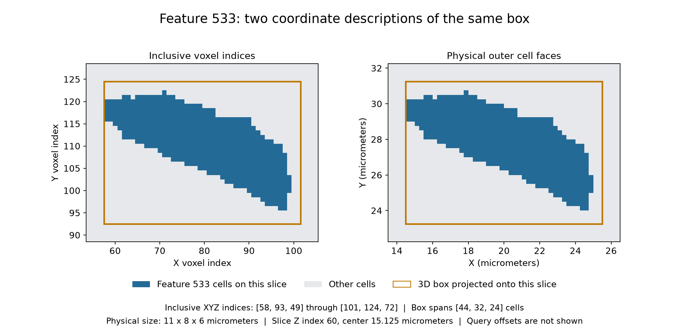

# Small IN100 Feature Bounds

Executable pipeline: `(01) Small IN100 Feature Bounds.d3dpipeline`

> **Before adapting:** Do not treat this example as a validated acceptance procedure. Adapt and validate it for the scanner, material, resolution, and quality requirement.

## At a glance

| Question | Answer |
| --- | --- |
| Use this when | You need a rectangular inspection region around each segmented grain |
| Input | Feature Measurements checkpoint from `Small_IN100_Examples` |
| Main result | Inclusive voxel-index corners and physical outer-cell-face bounds |
| Follow with | `(02) Small IN100 Feature and Box Quality` |

## Purpose and real-world setting

A materials analyst may want to find a grain in a reconstructed EBSD volume, request a voxel crop around it, or compare its image-quality distribution with its surroundings. Those tasks need different descriptions of the same region. This example stores both coordinate systems and keeps the original grain identifiers so a selected feature can be traced back to the image.

A rectangular box encloses the grain, but generally also contains other grains or background. Its volume therefore does not measure grain volume, and its edges do not describe the grain boundary. Use the predecessor's `NumElements` and `Size Volumes` for grain membership and volume.

## Inputs and workflow

Run Archive, Feature Preparation, and Feature Measurements in that order, then this pipeline. The [suite README](README.md) provides exact filenames, working-folder instructions, and provenance. The input is `Data/Output/Small_IN100_Examples/Measurements/SmallIN100_FeatureMeasurements.dream3d`: a 189 × 201 × 117 image with 0.25 µm spacing, final `FeatureIds`, and whole-feature measurements. Bounds use the saved origin, including its small nonzero offsets. No crop, resampling, or relabeling occurs.

| Step and choice | Why it is here |
| --- | --- |
| Read DREAM3D | Reuse the measured checkpoint and preserve its arrays |
| Compute Feature Corners | Store `FeatureIndexBounds` as six unsigned integers: minXYZ, maxXYZ, both inclusive |
| Compute Feature Bounding Boxes, Unified | Store `FeaturePhysicalBounds` as six physical coordinates in minXYZ/maxXYZ order; the upper bound is the outer cell face |
| Multi Threshold, `NumElements > 0` | Create `OccupiedPositiveFeatures` for grain reporting and valid box inputs |
| Array Calculator, `FeaturePhysicalBounds + 0.125` | Build `BoxQueryBounds` for stable voxel selection, preserving raw extents |
| Conditional Set Value, inverted occupancy mask | Replace excluded query rows with finite zero-size boxes |
| Write DREAM3D | Save the reusable bounds checkpoint |

For positive spacing, physical lower bounds are `origin + minIndex × spacing`; upper bounds are `origin + (maxIndex + 1) × spacing`. Thus a one-voxel feature has equal minimum/maximum **indices** but a nonzero physical width. Voxel indices are dimensionless; physical coordinates use the image's micrometers.

## Outputs and interpretation

The pipeline writes `Data/Output/Small_IN100_Spatial_Examples/Bounds/SmallIN100_FeatureBounds.dream3d`. New arrays live under `DataContainer/Cell Feature Data`. The raw bounds, occupancy mask, and `BoxQueryBounds` retain feature-row indexing.

For statistics, `BoxQueryBounds` shifts all six endpoints by 0.125 micrometers, half the supplied voxel spacing. The statistics filter floors both coordinate-to-index conversions and clips at the image boundary. This selects the same inclusive voxel rectangle while avoiding float32 rounding at exact cell faces. These are cell-interior query coordinates, **not new physical feature bounds**. Anisotropic spacing requires a separate half-spacing offset per axis.

Feature 0 is background. The corner filter skips it; the physical-bounds filter can enclose its observed cells. The predecessor intentionally stores `NumElements[0] = 0`, so the occupancy mask excludes it. Unused positive labels also have zero counts: their raw index minima are `UINT32_MAX`, their raw physical bounds are NaN, and they must not enter grain summaries. The statistics copy gives all excluded rows six zeroes, which describe an empty box, not a grain at the origin.

Feature 533 at Z index 60: the same projected box in voxel and physical coordinates. Its full 3D extent is 44 by 32 by 24 cells.

## Adaptation, alternatives, and pitfalls

Use index corners when configuring an inclusive voxel crop; use the prepared `BoxQueryBounds` for the next pipeline's box statistics. Do not feed integer corners to a physical-coordinate operation. Confirm that feature rows accommodate the maximum label, the label tuple shape matches the image, and geometry spacing and units are correct. Preserve `FeatureIds`; the earlier twin-processing `ParentIds` are a different namespace.

For oriented extents, examine the predecessor's fitted shape axes; this example computes axis-aligned boxes only. For exact grain voxels, select by label instead of box membership. Cropping first changes the measurement domain and can truncate grains; recompute feature measurements after such a change. Regenerate both spatial examples after changing preparation or geometry.

## Scientific basis and extensions

[Groeber and Jackson (2014)](https://doi.org/10.1186/2193-9772-3-5) describe measured reconstruction and feature statistics; Figure 5 and Table 2 provide context. This **illustrative** example adds index/physical bounds and valid-region handling to that workflow. It does not reproduce a named paper bounds result. The public archive's exact identity with the publisher supplement is unproven; the article is CC BY 2.0, while separate raw-archive redistribution terms are not established. No volume is bundled here.

For an LLM or MCP assistant: establish whether the request means inclusive indices, physical extents, or exact grain membership before changing the pipeline. Treat the `.d3dpipeline` as executable authority and keep output paths and predecessor order consistent.
