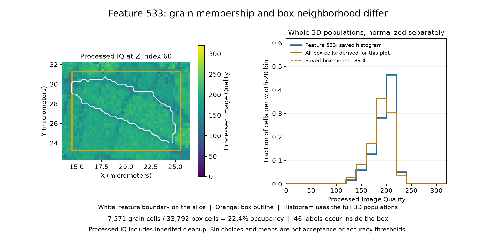

# Small IN100 Feature and Box Quality

Executable pipeline: `(02) Small IN100 Feature and Box Quality.d3dpipeline`

> **Before adapting:** Do not treat this example as a validated acceptance procedure. Adapt and validate it for the scanner, material, resolution, and quality requirement.

## At a glance

| Question | Answer |
| --- | --- |
| Use this when | You want to compare a grain's processed Image Quality with its spatial surroundings |
| Input | Spatial example 01, Feature Bounds |
| Membership result | One IQ histogram per original `FeatureId` |
| Spatial result | IQ statistics of every cell inside each feature's box |

## Purpose and real-world setting

A low-quality region in a reconstructed EBSD volume can cross grain boundaries. A histogram grouped by grain asks how the retained quality values are distributed among that grain's voxels. Statistics inside the grain's bounding box instead summarize a spatial neighborhood. Comparing these views helps an analyst decide which region to inspect before interpreting a feature report.

The input `Image Quality` has passed through the preparation workflow's alignment and cleanup. It is processed data, not untouched detector evidence, and it is not a calibrated accuracy measure. Neither a histogram peak nor a box mean provides a material acceptance threshold or a probability that an orientation is correct.

## Inputs and workflow

First run `(01) Small IN100 Feature Bounds` and its documented predecessors. Read `Data/Output/Small_IN100_Spatial_Examples/Bounds/SmallIN100_FeatureBounds.dream3d`. The [README](README.md) gives the complete chain and folder setup. This example preserves the full image, final `FeatureIds`, processed IQ, raw bounds, and occupancy mask.

| Step and choice | Reason and interpretation |
| --- | --- |
| Read DREAM3D | Start both summaries from the same saved source |
| Compute Array Histogram By Feature | Group scalar `Image Quality` by exact `FeatureIds` membership |
| 16 bins over `[0,320)` | Use shared width-20 intervals for comparisons; the supplied processed values range from 0 to about 313.3 |
| No histogram mask | Retain every cell, including background row 0, for transparent count accounting |
| Compute Bounding Box Statistics | Use `BoxQueryBounds` from stage 01; calculate cell count, minimum, maximum, mean, and population standard deviation |
| Write DREAM3D | Save both summaries with their original arrays |

The bounds predecessor shifts query endpoints by half a voxel so the filter's floor-and-clip index conversion includes the intended cells despite floating-point edge rounding; raw physical extents remain separate. The common range is a teaching choice, not an instrument calibration. The lower edge is included and the upper edge is excluded. Custom ranges discard out-of-range values; check the runner's messages and compare histogram totals with expected membership before reporting a result. Automatic ranges would give different edges for different grains, which complicates comparisons.

## Outputs and interpretation

The output is `Data/Output/Small_IN100_Spatial_Examples/Quality/SmallIN100_FeatureAndBoxQuality.dream3d`.

Histograms are under `DataContainer/FeatureIQHistograms/"Image Quality" Histogram`: `Counts`, `Ranges`, and `MostPopulatedBin`. The last array stores the winning bin index and its count; tied maxima select the first bin. Counts are not probabilities. Normalize each occupied positive feature's row by its count sum when comparing distribution shapes across unequal grain sizes. Empty feature rows contain zero counts and zero range values, not valid common-bin metadata.

`BoxCellCount`, `BoxIQMinimum`, `BoxIQMaximum`, `BoxIQMean`, `BoxIQStandardDeviation`, and `BoxHasData` are in `DataContainer/Cell Feature Data`. A box includes other grains and any background inside it. Its count can therefore exceed the feature's `NumElements`; overlapping boxes repeatedly sample the same cells and cannot be added as independent grain measurements. Mean accumulation uses float32, so small differences from a float64 reference are expected.

Report only positive rows with `OccupiedPositiveFeatures` true and, for box statistics, `BoxHasData` true. Background remains in histogram row 0 for inspection; its statistics box is deliberately empty. Ignore default or NaN statistics for excluded rows.

Feature 533 occupies 7,571 of 33,792 box cells (22.4%). The saved grain histogram and display-derived box histogram use full 3D populations; the IQ image shows one slice.

## Adaptation, alternatives, and pitfalls

Inspect finite IQ values and choose one defensible shared range before processing another scan. Change bin width to study sensitivity. Add an explicit cell mask only when the excluded population is understood; its histogram totals will then differ from full grain membership. A per-feature scalar mean answers a different question from this distribution and neighborhood comparison.

Do not interpret box standard deviation as within-grain variation, or box IQ as belonging only to the named grain. Preserve the distinction between original `FeatureIds` and twin-processing `ParentIds`. Recompute bounds after changing labels, origin, spacing, or image extent; rerun both spatial stages after upstream changes.

## Scientific basis and extensions

[Groeber and Jackson (2014)](https://doi.org/10.1186/2193-9772-3-5), especially Figure 5 and Table 2, motivate reconstruction followed by feature-level measurement. This **illustrative** IQ comparison is an extension, not a published paper result or exact reproduction. The article is CC BY 2.0; separate archive redistribution terms remain unestablished, and no volume is included.

For an LLM or MCP assistant: ask whether the intended population is a grain's member cells or every cell in a spatial box. Keep range, background policy, and interpretation explicit, and regenerate temporary Python from the authoritative pipeline after changes.
