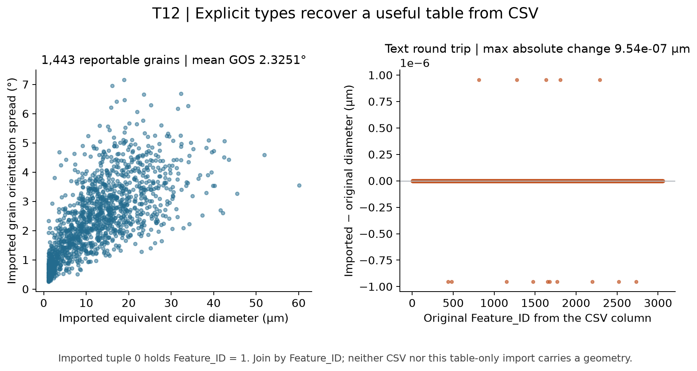

# T12 Typed CSV Import

Executable pipeline: `(01) T12 Typed CSV Import.d3dpipeline`

> **Before adapting:** Do not treat this example as a validated acceptance procedure. Adapt and validate it for the scanner, material, resolution, and quality requirement. Check the CSV header, row count, units, and column types. Keep `Feature_ID` for joins and `ReportableFeatures` for the intended population. Importing a table does not validate its grain measurements or establish an acceptance procedure.

## At a glance

- **Input:** `Data/Output/T12_Reporting_Examples/Report/T12_CompactReport.csv`, from [(03) T12 Compact Report](../T12_Reporting_Examples/%2803%29%20T12%20Compact%20Report.md).
- **Result:** `Data/Output/T12_Import_Examples/CSV/T12_CSVImport.dream3d`, containing `ImportedCSV` and `CSVSummary`.
- **Main choice:** Explicit column types and 3059 tuples; the reader does not infer the tuple dimensions.
- **Run order:** Run the combined orientation case study, then reporting derived fields and the compact report first. This import is independent of the selective DREAM3D import; see [run commands](README.md).

## Purpose and real-world setting

A collaborator may receive a grain measurement table without the full EBSD checkpoint. This pipeline reconstructs a typed table and checks its selected-grain GOS summary.

[Allain-Bonasso et al. (2012)](https://doi.org/10.1016/j.msea.2012.03.068) motivates grain-size and orientation-heterogeneity measurements in IF steel. CSV import and relative z scores are illustrative NX additions using the paper-linked T12 map; they do not reproduce the paper's import method or numerical results. See [data provenance and terms](README.md).

## Data flow and choices

| Step | Purpose and parameter choice |
| --- | --- |
| `ReadCSVFileFilter` | Read the comma-separated header on line 1 and data from line 2, without a count preamble. Parse all seven scalar columns in header order. `Feature_ID` and `NumElements` are int32; diameter, GOS, z score, and area are float32; the 0/1 reporting flag is uint8, which the statistics filter accepts as a mask. |
| Create `ImportedCSV` | The reader creates an Attribute Matrix with `[3059]` tuples. Update this dimension after checking any replacement table. A larger dimension is rejected; a smaller stale dimension leaves rows unread. |
| Calculate `CSVSummary` | `ComputeArrayStatisticsFilter` reads imported GOS and masks it with imported `ReportableFeatures`. Its one-row Length counts eligible grains and Mean gives their equally weighted GOS in degrees. |
| Save | `WriteDREAM3DFilter` persists the typed columns and summary. No image geometry is reconstructed. |

The first imported tuple has **array index 0 and `Feature_ID=1`**. Join on the explicit `Feature_ID` column after checking uniqueness and completeness. The source CSV omits background row 0 but includes positive IDs whose reporting flag is 0.

## Read the result

The result has **3,059 tuples and seven scalar arrays**, including **1,443 reportable grains**. Their mean GOS is **2.325059°**, matching the reporting summary to Float32 precision. The imported diameter differs from its source by at most **9.536743 × 10⁻⁷ µm**; the GOS difference is at most **7.450581 × 10⁻⁹°**. CSV decimal text can therefore preserve useful measurements without being bitwise identical to the original arrays.

## Adaptation and pitfalls

Confirm the exact header and row count before execution, then check types and selected count after import. Allow floating-point text rounding when comparing continuous values; integer IDs, counts, and flags should match exactly. The supplied comparison uses `rtol=1e-5` and `atol=1e-6` in each column's units.

CSV carries names and printed values, not geometry, explicit types, units, or background-row semantics. Keep a data dictionary: diameter is in micrometers, area in square micrometers, GOS in degrees, and z score dimensionless. A later vector-valued table needs a documented component order and array-combination step; these measurements are all scalar.

The `.d3dpipeline` is authoritative. An assistant adapting it should check the actual header, count, and ID convention before proposing a type or tuple shape.
