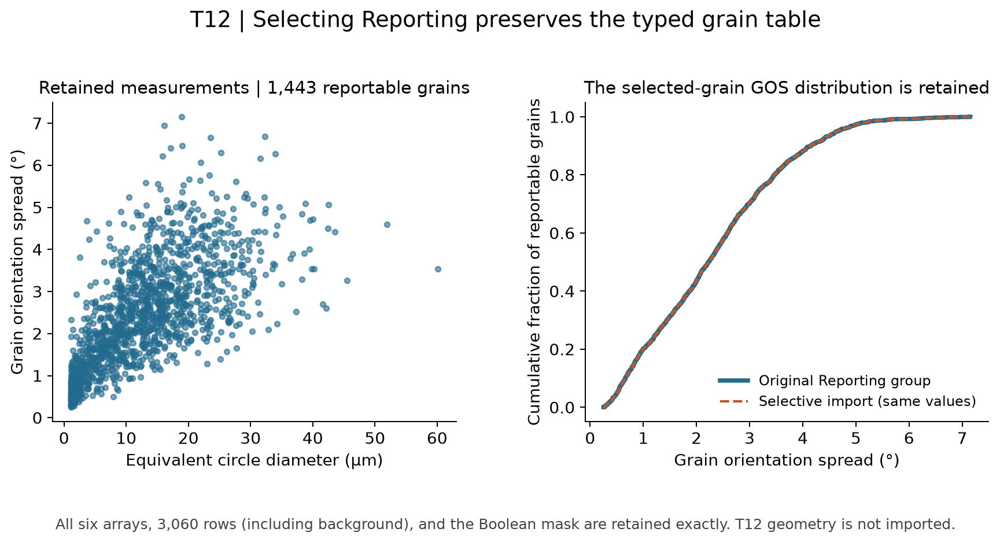

# T12 Selective DREAM3D Import

Executable pipeline: `(02) T12 Selective DREAM3D Import.d3dpipeline`

> **Before adapting:** Do not treat this example as a validated acceptance procedure. Adapt and validate it for the scanner, material, resolution, and quality requirement. Inspect the selected path and descendants, feature-row convention, and reporting mask. Preserving a table's types and shape does not validate its measurements or recreate its spatial context.

## At a glance

- **Input:** `Data/Output/T12_Reporting_Examples/Report/T12_CompactReport.dream3d`, from [(03) T12 Compact Report](../T12_Reporting_Examples/%2803%29%20T12%20Compact%20Report.md).
- **Result:** `Data/Output/T12_Import_Examples/Structured/T12_StructuredImport.dream3d`, containing `Reporting/Cell Feature Data` and `StructuredSummary`.
- **Main choice:** Select the `Reporting` group with `IncludeList`, preserving descendants while excluding the original `T12` tree.
- **Run order:** Run the combined orientation case study, then reporting derived fields and the compact report first. The CSV import is independent; see [run commands](README.md).

## Purpose and real-world setting

A complete EBSD checkpoint can contain far more than a collaborator needs for a grain report. This pipeline reads only the prepared table, retaining its source types and original feature-row indexing.

[Allain-Bonasso et al. (2012)](https://doi.org/10.1016/j.msea.2012.03.068) motivates the IF-steel grain measurements. Selective structured import is an illustrative NX extension using the paper-linked public map, not the paper's import procedure or numerical reproduction. The [suite README](README.md) gives data provenance and release terms.

## Data flow and choices

| Step | Purpose and parameter choice |
| --- | --- |
| `ReadDREAM3DFilter` | Set `data_paths` to `Reporting` and `path_import_policy=1` (`IncludeList`). Selecting the group imports its descendants and required ancestors. The separate original `T12` geometry and cell arrays are outside the selection. Policy 0 would import all paths. |
| Calculate `StructuredSummary` | `ComputeArrayStatisticsFilter` reads GOS under `Reporting/Cell Feature Data` and applies its Boolean `ReportableFeatures` mask. Length and Mean summarize reportable grains with equal weight. Keeping the summary outside `Reporting` leaves the imported table recognizable. |
| Save | `WriteDREAM3DFilter` persists this selected hierarchy and summary. The result is a table checkpoint without an image geometry. |

The Attribute Matrix retains six scalar arrays: `EquivalentCircleDiameters`, `GOSZScore`, `GrainOrientationSpread`, `NumElements`, `PixelAreas`, and `ReportableFeatures`. Original feature IDs are tuple indices, so no added `Feature_ID` column is needed. Background remains at row 0. This differs from CSV, which removes background and adds an explicit ID column.

## Read the result

The import preserves **3,060 rows and all six arrays exactly**, including Float32 measurements, int32 counts, and the Boolean mask. Its **1,443 reportable grains** have mean GOS **2.325059°**. The original and imported cumulative GOS curves coincide. The saved roots are `Reporting` and `StructuredSummary`; `T12` is absent.

## Adaptation and pitfalls

Inspect descendants when an upstream report changes: selecting a group imports every new child too. A leaf-only selection omits sibling measurements. Check row 0, tuple count, and ID range before joining rows to any external labels. Equal numeric IDs across unrelated maps do not identify the same grains.

Unlike CSV, this route avoids a decimal-text precision boundary and preserves the Attribute Matrix shape and array types. It does not supply a geometry, calibration, or original pixel-quality masks. Use the full checkpoint for spatial work.

GOS is in degrees, diameter in micrometers, area in square micrometers, and z score dimensionless. These units come from the upstream workflow; the selected group has no geometry-unit or per-array-unit metadata. Retaining types alone does not establish units.

The `.d3dpipeline` is authoritative. An assistant should preserve `IncludeList=1`, the intended descendants, and the feature-row convention when adapting the example.
