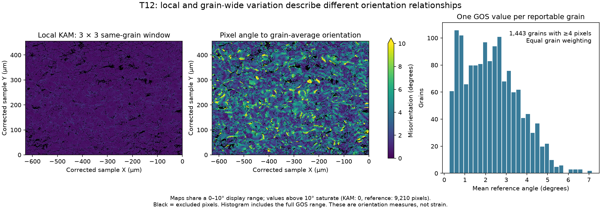
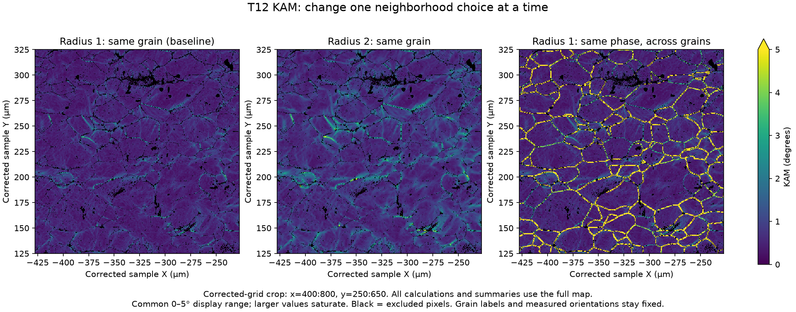

# T12 Orientation Case Study

Executable pipeline: `(01) T12 Orientation Case Study.d3dpipeline`

> **Before adapting:** Review acquisition conventions, phase symmetry, validity, resolution, and grain definition. Do not treat this example as a validated acceptance procedure. Adapt and validate it for the scanner, material, resolution, and quality requirement. This is an illustrative case study, not an exact paper reproduction.

## At a glance

- **Question:** How do local orientation variation, grain-wide spread, and KAM neighborhood choices differ on one measured steel map?
- **Input:** One public 2D EBSD map, `fw-ar-IF1-aptr12-corr.ctf`.
- **Result:** Corrected-frame orientation and grain maps, three KAM maps, grain-reference angles, grain spreads, six summaries, and a feature CSV.
- **Run:** Execute this one 23-step pipeline after the data setup in the [README](README.md). Intermediate checkpoints preserve compatibility with the reporting and import examples.
- **Main choices:** Preserve measurements; select reporting populations separately; change KAM radius and grouping one at a time.

## Purpose and real-world setting

[Allain-Bonasso et al. (2012)](https://doi.org/10.1016/j.msea.2012.03.068) studied heterogeneous plastic deformation in interstitial-free steel. Sections 2.2–2.4 motivate the grain definition and orientation measures here. EBSD measures orientation at surface positions; these outputs describe angular relationships, not calibrated strain or dislocation density.

The map contains **1,255 × 911 × 1 cells**, one BCC iron phase, **0.5 µm XY spacing**, and unit Z spacing. It is a measured surface, not a 3D grain volume. The archive filenames do not establish deformation state, correspondence to a paper figure, or matching grains between scans.

## Data flow and choices

| Steps | Choice and reason |
|---|---|
| 1–2: Read CTF; Rotate Sample Reference Frame | Convert Euler degrees to radians, then apply the documented default Oxford/HKL correction: **180° about Y**, before masks or segmentation. This rearranges cell positions and retains the transform-derived origin. No additional Euler-frame rotation is prescribed for this CTF/BCC input. Acquisition conventions matter: EDAX ANG data may also need a 90° Z Euler correction, depending on acquisition settings/software version; do not add that to T12. |
| 3–5: Mask; convert to quaternions; segment | `IndexedPixels` requires **Phases > 0 AND Error == 0**; Error alone admits 274 phase-zero cells. Segment valid, same-phase face neighbors with misorientation **below 5°**, without periodic wrapping or randomized labels. This is a connected-neighbor rule: a grain can span a larger total rotation. The mask is an admission rule, not proof of orientation accuracy. |
| 6–8: Feature sizes; average orientations; reporting mask | Measure every positive feature, use symmetry-aware **Rodrigues averaging** for `AvgQuats`, and select **NumElements ≥ 4** for `ReportableFeatures`. Smaller grains remain in the data. Four pixels equal 1 µm² here. `PixelAreas = NumElements × 0.25 µm²`; equivalent-circle diameter is `2√(area/π)`. The single-slice size calculation includes Z spacing, so changing it changes reported areas. |
| 9–10: IPF colors; preparation checkpoint | Sample-Z IPF colors provide orientation context. Save masks, labels, sizes, and references under `Preparation/`. Feature row 0 is background. These colors do not establish a loading-axis relationship. |
| 11–17: Local and grain-reference metrics | Compute radius-one same-grain KAM once, compare each cell with its grain `AvgQuats`, save mean reference angle per grain as `GrainOrientationSpread` (GOS), calculate three summaries, and write the feature CSV and `Metrics/` checkpoint. All angle outputs are **degrees**. |
| 18–23: Neighborhood comparison | Add radius-two same-grain and radius-one same-phase KAM, calculate three neighborhood summaries, and save the complete data structure under `Neighborhoods/`. It retains every preparation and metric array. |

The sample correction reverses X ordering for this single-slice map. Imported `X`/`Y` arrays remain acquisition columns attached to the moved cells; use the corrected geometry for spatial coordinates. Feature numbering and Rodrigues averages can depend on traversal order, so numeric IDs and reference means must not be assumed identical to an uncorrected run. Compare current checkpoints consistently. Never average Euler components directly across wraparound; to study another mean estimator, keep labels fixed and select its quaternion output for reference angles.

## Why these KAM settings?

| Output | Radius; admitted neighbors | Interpretation |
|---|---|---|
| `KAM_R1_Grain` | **[1, 1, 0]**, clipped 3 × 3 × 1; matching positive feature ID | Smallest nonzero in-plane baseline, with 0.5 µm axial reach. It shows local variation without averaging over a wider footprint. This is an illustrative choice, not a paper-optimized or calibrated setting. |
| `KAM_R2_Grain` | **[2, 2, 0]**, clipped 5 × 5 × 1; same grain | Holds grouping fixed and increases axial reach to 1.0 µm. More distant cells can raise or lower an individual average. |
| `KAM_R1_Phase` | **[1, 1, 0]**; same phase across positive feature IDs | Holds radius fixed and allows grain-boundary comparisons. It changes the question rather than improving the same quantity. |

Feature mode checks matching IDs; it does **not** separately check each neighbor's phase. Preparation makes each grain phase-coherent. Phase mode excludes feature-zero and phase-zero cells. All windows include the center's zero angle and qualifying diagonals; diagonal reach is greater than axial reach. Map edges, invalid gaps, and boundaries change the admitted count. A single-pixel grain can have zero KAM. The segmentation tolerance is **not** an additional KAM angle cutoff.

The preserved `EBSD_File_Processing/aptr12_Analysis.d3dpipeline` contains **[1, 1, 1]** in this checkout: one-slice clipping gives the same footprint as [1, 1, 0]. A separately reported **[3, 3, 1]** variant would span 7 × 7 in-plane cells and 1.5 µm axially. These are parameter comparisons; the legacy workflow and radius-three variant were not executed for this case study.

## Outputs and interpretation

All paths start with `Data/Output/T12_Orientation_Examples/`:

- `Preparation/T12_Orientations.dream3d`: corrected geometry, measured orientations, masks, labels, sizes, and averages.
- `Metrics/T12_MisorientationMetrics.dream3d` and `.csv`: local/reference angles, GOS, and three summaries. CSV contains positive feature rows, including small grains; select its `ReportableFeatures` column for the grain population.
- `Neighborhoods/T12_NeighborhoodComparison.dream3d`: complete case study, including all metric arrays and the three KAM variants.

`PixelKAMSummary`, `PixelReferenceSummary`, and all three `KAM_*Summary` matrices weight each `IndexedPixels` cell equally, including small grains. `GrainGOSSummary` weights each reportable grain once. Each saves Length, Minimum, Maximum, Mean, Median, and population StandardDeviation. Check Length against the corresponding mask. Equal pixel weighting favors larger grains; it is not equal grain weighting or the paper's GAM.

Verified corrected-run results: **1,038,142 admitted pixels**, **3,059 positive grains**, and **1,443 reportable grains**.

| Output / population | Mean (°) | Population SD (°) | Maximum (°) |
|---|---:|---:|---:|
| `KAM_R1_Grain` / admitted pixels | 0.57397 | 0.26895 | 7.18223 |
| `KAM_R2_Grain` / admitted pixels | 0.82345 | 0.40364 | 7.86957 |
| `KAM_R1_Phase` / admitted pixels | 1.20792 | 2.72605 | 39.93160 |
| Reference angle / admitted pixels | 3.32427 | 2.03032 | 17.37369 |
| GOS / reportable grains | 2.32506 | 1.31176 | 7.15157 |

Windows in-memory Release execution and independent angle/statistics checks passed. The orientation-mean estimator, materials interpretation, GUI, OOC, and generated Python remain unverified.

The metric maps share a 0–10° display range; the GOS histogram includes the full range. Black denotes excluded pixels, distinct from valid zero values.

The KAM figure uses corrected-grid indices `x=400:800`, `y=250:650` and geometry-derived physical coordinates, with a common 0–5° display range. These index bounds select a different acquisition region after the X reflection. Saturation changes only the display; calculations and summaries use the full map.

## Differences from the paper and extension paths

| Difference and reason | How to extend without changing the question silently |
|---|---|
| **No noise reduction:** preserves a measured baseline; Section 2.2 does not provide a reproducible sequence and settings. Rejected gaps can fragment grains. | Branch before quaternion conversion; preserve original arrays and validity. Document cleaning and rerun labels, averages, and metrics. Neighbor replacement can copy all cell attributes and propagate orientations across boundaries; it is not established as the paper's method. Distinguish filled from measured pixels. |
| **NX square KAM:** demonstrates native radius/grouping choices; the paper's Equation 3 uses four surrounding neighbors. | A validated script/filter must select axial neighbors and define boundary, invalid-pixel, and edge rules. No NX radius excludes both center and diagonals; a constant multiplier cannot remove diagonal contributions. Test hand-checkable orientations first. |
| **No GAM, GOS/D, or ranked subpopulations:** keeps local variation, size normalization, and population selection separate. | For GAM, compute masked per-feature KAM means with ID-aligned rows, then average eligible nonempty grains equally. This remains an NX-based analogue unless KAM/preprocessing match. For GOS/D, use positive, compatible diameters and degrees/µm. Paper subpopulations represent approximately 25% of mapped area, not 25% of grain rows; define ranking, exclusions, ties, and denominator. |
| **No GND or matched deformation analysis:** one scalar-angle map cannot establish either. | GND requires a separately validated directional curvature method and dislocation assumptions; the paper uses a 2 µm calculation step and a 2D lower bound. Changing spacing metadata is not resampling. For paired scans, establish deformation states, common frames, and grain correspondence; alignment or equal IDs alone cannot identify matching grains. |

Treat `.d3dpipeline` as executable authority. Regenerate all checkpoints after processing changes; these reference values do not validate the revised analysis.
