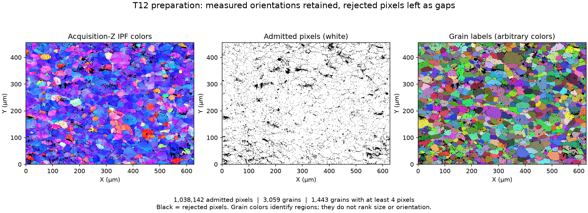

# T12 Orientation Preparation

Executable pipeline: `(01) T12 Orientation Preparation.d3dpipeline`

> **Before adapting:** This pipeline is configured for the supplied T12 map. Review its input requirements, assumptions, and parameters before using other data. Do not treat this example as a validated acceptance procedure. Adapt and validate it for the scanner, material, resolution, and quality requirement.

## At a glance

- **Input:** One public 2D electron backscatter diffraction (EBSD) map of interstitial-free steel.
- **Result:** Measured orientations, valid-pixel and grain-reporting masks, grain labels, areas, and average orientations in one reusable checkpoint.
- **Main choice:** Preserve measurements and small grains; select reporting populations separately.
- **Run order:** Start here, then reuse the saved checkpoint for orientation comparisons. Data setup is in the [suite README](README.md).

## Purpose and real-world setting

Prepare a consistent grain definition before comparing local and grain-wide orientation variation. EBSD measures crystal orientation at sampled surface positions. Here, a grain groups connected, sufficiently similar orientations; its boundary is not independently verified.

The workflow uses data linked to [Allain-Bonasso et al. (2012), DOI 10.1016/j.msea.2012.03.068](https://doi.org/10.1016/j.msea.2012.03.068), which studied heterogeneous plastic deformation in steel. This preparation is **illustrative**, not a reproduction of the paper's full analysis.

## Input and run order

Extract the public `T12-MAI-2010.tar.gz` archive so the working folder contains `Data/T12-MAI-2010/fw-ar-IF1-aptr12-corr.ctf`. Run this pipeline from that folder. In the GUI, use **File > Open** and set absolute input/output file paths if relative paths do not resolve.

The supplied map has **1,255 × 911 × 1 cells**, **0.5 µm XY spacing**, and **unit Z spacing**. It measures a surface, not 3D grain volumes. Its file name does not establish deformation state or correspondence to a published figure.

## Data flow and choices

| Stage | Why this choice and what to watch for |
|---|---|
| Read CTF → `EulerAngles`, `Phases`, quality arrays, crystal symmetry | Convert degrees to radians for downstream filters. Keep the acquisition frame: these examples study relative angles, not loading-axis alignment. Check phase symmetry before adapting. |
| Multi-Threshold → `IndexedPixels` | Require **`Phases > 0 AND Error == 0`**. Error alone admits 274 phase-zero pixels in this file. This is an explicit admission rule, not proof that every accepted orientation is accurate; assess additional quality criteria for another acquisition. |
| Convert Orientations → `Quats`; Segment Features → `FeatureIds` | Quaternions and phase symmetry support angular comparison without treating Euler components as independent intensities. Use the paper's **below-5°** criterion, face connectivity, and no periodic wrapping. Diagonal connectivity could join otherwise separate regions; a lower tolerance can split noisy grains, while a higher tolerance can merge low-angle boundaries. A chain of small neighbor differences can span a larger overall rotation. |
| Compute Feature Sizes → `NumElements`, `PixelAreas`, `EquivalentCircleDiameters` | Measure all positive labels before selecting a population. With the supplied unit Z spacing, area is `NumElements × 0.25 µm²` and diameter is `2 × sqrt(area/π)`. The current single-slice calculation includes Z spacing in its area factor: changing that spacing changes these numbers. Equivalent-circle diameter measures area, not elongation or 3D grain size. |
| Compute Feature Average Orientations → `AvgQuats`, `AvgEulerAngles` | Fix Rodrigues averaging as the reference for comparisons. It handles symmetry equivalents; averaging Euler components directly can fail at angular wraparound. The von Mises–Fisher and Watson options define alternative references. The paper does not establish which current NX option reproduces its mean. |
| Multi-Threshold → `ReportableFeatures` | Select **`NumElements >= 4`**, following the paper's exclusion of smaller grains. Four pixels equal 1 µm² here. Preserve excluded grains and labels: minimum-size reassignment would change boundaries and downstream orientation statistics. |
| Compute IPF Colors → `IPFColors`; Write DREAM3D | Acquisition-Z colors provide orientation context, not strain or quality values. Save arrays, masks, and references together so every later comparison starts from the same measurements. |

No filling, smoothing, or neighbor-value replacement is applied. The paper's noise reduction lacks sufficient detail for reproduction here. Preserving measurements leaves invalid gaps that can fragment grains and affect neighborhood statistics.

## Outputs and interpretation

The checkpoint is `Data/Output/T12_Orientation_Examples/Preparation/T12_Orientations.dream3d`. Inspect `T12/Cell Data` for pixel arrays and `T12/Cell Feature Data` for grain arrays.

- `IndexedPixels` should contain **1,038,142 true values** out of 1,143,305 pixels. Rejected pixels receive `FeatureIds = 0`; feature row 0 is background.
- Select `ReportableFeatures` for grain summaries. Smaller grains retain their measured orientations and labels despite exclusion from that population.
- This reconstruction has **3,059 positive grain labels**, of which **1,443** have at least four pixels. These are reference results for this input and preparation, not the paper's grain counts or acceptance values for other scans.

The view shows the full measured map. Black gaps remain excluded from segmentation. Grain colors are arbitrary labels; compare boundaries and mask coverage rather than interpreting a label color as a physical quantity.

## Adaptation and scientific limits

Reassess the validity rule, angular tolerance, connectivity, spatial resolution, and averaging method together. Recompute this checkpoint and dependent pipelines after changing them; feature numbers are labels, not stable identities across reconstructions or maps.

The archive notice attributes public release to Francis Wagner and permits distribution with DREAM.3D; it names no standard license. Raw data are downloaded separately. The paper's Section 2.2 supports the acquisition spacing and grain-size/tolerance choices. Its noise reduction, multi-map grain matching, deformation history, and full results are not reproduced.

For an LLM or MCP assistant: recommend this as a preparation pattern after checking those assumptions. Treat the `.d3dpipeline` arguments as executable authority, and never infer strain, a measured 3D volume, or a loading-axis relationship from this checkpoint.
