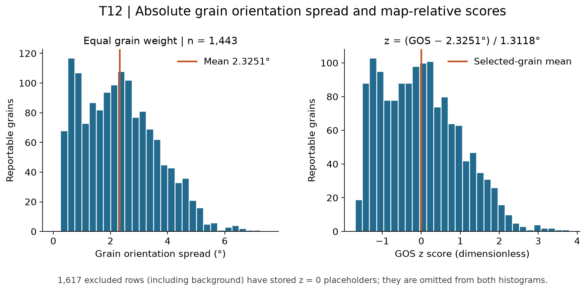

# T12 Derived Reporting Fields

Executable pipeline: `(01) T12 Derived Reporting Fields.d3dpipeline`

> **Before adapting:** Do not treat this example as a validated acceptance procedure. Adapt and validate it for the scanner, material, resolution, and quality requirement. Validate the phase symmetry, indexing quality, grain definition, and reporting population for your material. A z score describes selected grains in this map; it is not a strain measurement or an acceptance limit.

## At a glance

- **Input:** `Data/Output/T12_Orientation_Examples/Metrics/T12_MisorientationMetrics.dream3d`, from [T12 Orientation Case Study](../T12_Orientation_Examples/%2801%29%20T12%20Orientation%20Case%20Study.md).
- **Result:** `T12/Cell Feature Data/GOSZScore` and `T12/ReportingReferenceSummary`, saved in `Data/Output/T12_Reporting_Examples/Derived/T12_ReportingFields.dream3d`.
- **Main choice:** Each reportable grain contributes once to the reference mean and population standard deviation.
- **Run order:** Run the combined T12 Orientation Case Study first. Use the same writable working folder; the [suite README](README.md) gives commands.

## Purpose and real-world setting

Grain orientation spread (GOS) summarizes angular differences between a grain's pixels and its grain-average orientation. Use this pipeline to place each grain's GOS relative to a clearly selected population while retaining the original angles in degrees.

[Allain-Bonasso et al. (2012)](https://doi.org/10.1016/j.msea.2012.03.068) studied grain-level orientation heterogeneity in IF steel. The public T12 map is linked to that study. Z-score reporting is an illustrative NX extension: it does not reproduce a paper plot, noise reduction, matched-map analysis, or deformation-state assignment. The [suite setup and provenance](README.md) describe the archive's release terms.

## Data flow and choices

| Step | Purpose and parameter choice |
| --- | --- |
| Read the metrics checkpoint | `ReadDREAM3DFilter` imports the complete saved structure, preserving labels, GOS, and the existing `ReportableFeatures` mask. No orientation or segmentation calculation is repeated. |
| Summarize eligible grains | `ComputeArrayStatisticsFilter` uses GOS and `ReportableFeatures`, with `compute_by_index=false`, to create one summary row. The mask accepts grains with at least four pixels. Each selected grain has equal weight; Length is a grain count and the angular statistics are in degrees. |
| Add a relative score | The same filter enables `standardize_data=true`: `GOSZScore = (GOS − Mean) / StandardDeviation` on selected rows. Population deviation divides by the selected count, not count minus one. The original GOS remains available. |
| Save | `WriteDREAM3DFilter` saves the complete checkpoint for either later reporting example. |

Excluded rows receive initialized z-score zeros. They are placeholders, so always apply `ReportableFeatures` when plotting or summarizing the score. An eligible grain with z near zero is near the selected mean; an excluded zero carries no such meaning.

## Read the result

The supplied run selects **1,443 grains**, with mean GOS **2.325059°**, median **2.224737°**, and population deviation **1.311755°**. Their z scores span **−1.580571 to 3.679429**, with mean near zero and population deviation near one. The 1,617 excluded rows, including background, are omitted from both histograms.

## Adaptation and pitfalls

Check a nonempty cohort and positive finite deviation before using z scores. A constant cohort makes the division undefined; pipeline completion alone does not establish valid standardized values. Changing the grain-size threshold requires regenerating the mask and reviewing the new population.

For specimen comparisons, keep absolute GOS under controlled acquisition and segmentation. Standardizing each map separately removes between-map mean shifts. A shared reference needs one established mean and deviation applied unchanged to every map. For skewed data, also inspect medians or quantiles. A GOS/diameter extension would require positive diameters and units of degrees per micrometer; it is not part of this pipeline.

The `.d3dpipeline` defines the actual arguments. An assistant adapting this example should identify the mask and reference population before interpreting a score.
