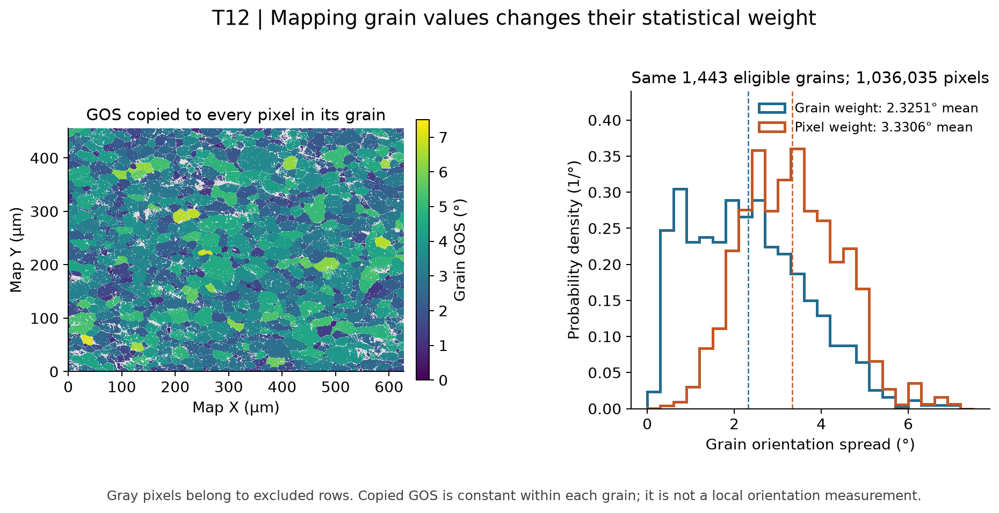

# T12 Feature to Cell Mapping

Executable pipeline: `(02) T12 Feature to Cell Mapping.d3dpipeline`

> **Before adapting:** Do not treat this example as a validated acceptance procedure. Adapt and validate it for the scanner, material, resolution, and quality requirement. Check that `FeatureIds` indexes the correct feature rows and decide whether grains or pixels should have equal weight. A copied grain value is not a new pixel-scale orientation measurement.

## At a glance

- **Input:** `Data/Output/T12_Reporting_Examples/Derived/T12_ReportingFields.dream3d`, from [(01) T12 Derived Reporting Fields](%2801%29%20T12%20Derived%20Reporting%20Fields.md).
- **Result:** Three `_Cell` arrays and `T12/CellWeightedGOSSummary`, saved in `Data/Output/T12_Reporting_Examples/Mapping/T12_FeatureMaps.dream3d`.
- **Main choice:** Broadcast grain values through `FeatureIds`, then compare a pixel-weighted mean with the equal-grain mean.
- **Run order:** Complete the orientation metrics and reporting-fields examples first. The compact report is independent of this step; see [run commands](README.md).

## Purpose and real-world setting

Broadcasting an EBSD grain measurement to pixels makes a spatial map. A summary over that map repeats each grain's value once per pixel, giving large grains more weight. This example makes that change in the unit of observation explicit.

[Allain-Bonasso et al. (2012)](https://doi.org/10.1016/j.msea.2012.03.068) motivates grain-scale orientation analysis in IF steel. The paired weighting comparison is an illustrative NX addition using its paper-linked public T12 map. It does not reproduce the paper's figures, noise reduction, matched grains, or deformation analysis. See the [archive provenance](README.md).

## Data flow and choices

| Step | Purpose and parameter choice |
| --- | --- |
| Read the derived checkpoint | Import the full structure so the source feature values, labels, mask, and equal-grain summary remain available. |
| Map through feature IDs | `CopyFeatureArrayToElementArrayFilter` looks up `GrainOrientationSpread`, `GOSZScore`, and `ReportableFeatures` using `T12/Cell Data/FeatureIds`. Suffix `_Cell` distinguishes the three copied cell arrays from their feature sources. |
| Summarize accepted pixels | `ComputeArrayStatisticsFilter` takes `GrainOrientationSpread_Cell` and masks it with `ReportableFeatures_Cell`. Its one-row summary records the accepted cell count and angular statistics. Each accepted pixel contributes once. |
| Save the map | `WriteDREAM3DFilter` retains the full original structure and the copied arrays for a spatial view. |

GOS remains in degrees and z score remains dimensionless. Background ID 0 indexes feature row 0; the reporting mask excludes it from statistics. Display excluded cells separately. Their stored z-score zeros are placeholders, not evidence that their GOS equals the selected mean.

## Read the result

The map uses **1,143,305 pixels** at **0.5 µm** X/Y spacing. Its 1,443 reportable grains occupy **1,036,035 pixels**. Equal grain weighting gives mean GOS **2.325059°**; pixel weighting gives **3.330604°**. Gray marks excluded pixels. The two histograms use the same eligible grains, with weights of one or each grain's pixel count. Their mean difference reflects weighting, not a change to orientations or segmentation.

## Adaptation and pitfalls

Check that all cells sharing an ID receive the corresponding source-row values and mask. The pixel-weighted mean should equal `sum(GOS × accepted pixel count) / sum(accepted pixel count)` over eligible grains. Verify `NumElements` against the label map before using it as that weight.

Every pixel within a grain has the same copied GOS. Use upstream reference misorientation or KAM for within-grain variation. For a feature-only report, omit these repeated cell arrays; large 3D maps can make the copies expensive. Pixel weighting corresponds to area weighting here because all cells have equal area; revisit that assumption for different geometries.

The `.d3dpipeline` is authoritative. An assistant should establish the intended unit of observation before proposing a representative mean.
