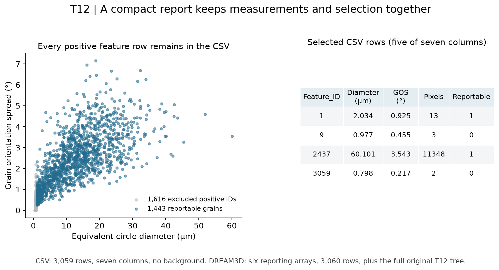

# T12 Compact Report

Executable pipeline: `(03) T12 Compact Report.d3dpipeline`

> **Before adapting:** Do not treat this example as a validated acceptance procedure. Adapt and validate it for the scanner, material, resolution, and quality requirement. The CSV retains every positive feature ID, including excluded grains. Apply `ReportableFeatures` for selected-grain statistics, and check headers, units, and types before sharing or importing the table.

## At a glance

- **Input:** `Data/Output/T12_Reporting_Examples/Derived/T12_ReportingFields.dream3d`, from [(01) T12 Derived Reporting Fields](%2801%29%20T12%20Derived%20Reporting%20Fields.md).
- **Results:** `Data/Output/T12_Reporting_Examples/Report/T12_CompactReport.csv` and `T12_CompactReport.dream3d` in the same folder.
- **Main choice:** Copy the feature Attribute Matrix into `Reporting/Cell Feature Data` and trim only the copy to six scalar arrays.
- **Run order:** Run the metrics and derived-fields examples first. Feature-to-cell mapping is not required; see [run commands](README.md).

## Purpose and real-world setting

A compact grain table helps collaborators work with size and orientation spread without navigating pixel arrays and orientation vectors. Retaining the selection flag keeps the reporting population visible.

[Allain-Bonasso et al. (2012)](https://doi.org/10.1016/j.msea.2012.03.068) motivates these grain measurements through its IF-steel study. The six-column report, CSV representation, and z score are illustrative NX choices, not the paper's published tables. Noise reduction, matched grains, and deformation conclusions are outside this example. The [suite README](README.md) records the paper-linked archive and release terms.

## Data flow and choices

| Step | Purpose and parameter choice |
| --- | --- |
| Read the derived checkpoint | Import the complete structure afresh, making this branch independent of the mapping example. |
| Create `Reporting` and copy | `CreateDataGroupFilter` creates the group; `CopyDataObjectFilter` copies `T12/Cell Feature Data` into it without a suffix. Copying the Attribute Matrix preserves tuple dimensions and every original row, including background. |
| Trim the copy | `DeleteDataFilter` removes `Active`, `AvgEulerAngles`, and `AvgQuats` only from `Reporting/Cell Feature Data`. The original `T12` tree remains intact. Recheck the retained columns if upstream arrays change. |
| Export CSV | `WriteFeatureDataCSVFilter` uses a comma, a header, no count preamble, and no neighbor-list sections. It adds `Feature_ID` from the original tuple index and skips row 0. The mask is a column, not a row filter. |
| Save DREAM3D | The writer saves both the compact group and complete original `T12` tree. This supports later selective import; the saved file itself is not report-only. |

The exact CSV header is:

```text
Feature_ID,EquivalentCircleDiameters,GOSZScore,GrainOrientationSpread,NumElements,PixelAreas,ReportableFeatures
```

Diameter is in micrometers, pixel area in square micrometers, and GOS in degrees. `NumElements` counts pixels, `GOSZScore` is dimensionless, and `ReportableFeatures` is Boolean in DREAM3D and 0/1 in CSV.

## Read the result



The CSV has **3,059 rows and seven columns**: 1,443 reportable grains and 1,616 excluded positive IDs. For example, feature 9 has three pixels and remains present with flag 0. The DREAM3D reporting table has **3,060 rows and six arrays**, retaining background row 0; its original `T12` tree is also preserved.

## Adaptation and pitfalls

Check the plain-text header, first ID 1, unique IDs, and actual row count before import. Compare measurements by feature ID; equal IDs from different maps do not identify matched grains. Keep the mask with z scores because excluded zeros are placeholders. A new measurement needs an explicit unit and population definition.

Use the [import examples](../T12_Import_Examples/README.md) to compare explicit CSV typing with selective structured import. Relative file paths resolve from the working folder. An assistant should preserve this row contract and treat the `.d3dpipeline` as executable authority.
