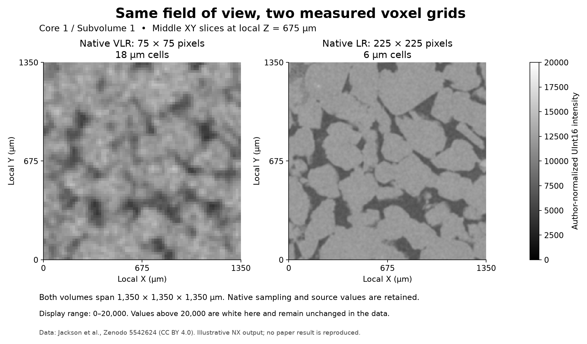

# Bentheimer Native Volume Preparation

Executable pipeline: `(01) Bentheimer Native Volume Preparation.d3dpipeline`

> **Before adapting:** Do not treat this example as a validated acceptance procedure. Adapt and validate it for the scanner, material, resolution, and quality requirement.

## At a glance

| Question | Answer |
| --- | --- |
| Use this when | You need to import registered CT cubes without losing their physical size |
| Input | Two author-normalized Core 1 / Subvolume 1 raw files from Zenodo |
| Main result | Native 75³ and 225³ grids covering the same 1,350 µm cube |
| Follow with | `(02) Bentheimer Common Grid Comparison` |

## Purpose and real-world setting

Digital rock analysis often compares scans acquired at different optical magnifications. A finer grid contains more cells, but it need not cover a larger specimen. Headerless raw files carry none of the dimensions, spacing, or numeric-type information needed to make that distinction. This example imports a mutually registered pair of measured Bentheimer sandstone scans and records those choices explicitly before any comparison.

The authors call the 18 µm scan very low resolution (VLR) and the 6 µm scan low resolution (LR). These are separate acquisitions, already reconstructed, registered, and normalized by the authors. They are not CT projection measurements, and the VLR file is not a downsample of the LR file generated by this pipeline.

## Inputs and workflow

Follow the [README](README.md) to download and checksum the exact two files into `Data/Bentheimer_Resolution_Examples`. The 18 µm filename ends in `18micron_75cube_16bit_LE_normalised.raw`; the 6 µm filename ends in `6micron_225cube_16bit_LE_normalised.raw`. They contain 843,750 and 22,781,250 bytes respectively. [DataSources.json](DataSources.json) records complete names, URLs, lengths, and SHA-512 hashes.

The five steps are two geometry/import pairs followed by a checkpoint write:

| Step and choice | Reason |
| --- | --- |
| Create Image Geometry, 75 × 75 × 75, spacing 18 µm | Preserve the VLR sampling and field of view |
| Read Raw Binary, UInt16, little endian, zero header bytes | Interpret the released storage without numeric conversion |
| Create Image Geometry, 225 × 225 × 225, spacing 6 µm | Preserve the independently acquired LR sampling |
| Read Raw Binary with the same storage settings | Populate the matching native LR grid |
| Write DREAM3D | Save both inputs for the comparison chain |

Each geometry uses `CellData/AuthorNormalizedIntensity`, one scalar per cell. Tuple dimensions are inherited from the geometry's attribute matrix; partial filling is disabled. Storage order is X fastest, corresponding to a C-order `[Z,Y,X]` array. The source's 6 µm raster order was cross-checked against its released TIFF; the 18 µm order is supported by metadata and cross-resolution structural correspondence. These checks do not identify scanner/world-axis directions.

Both lower-corner origins are `[0,0,0]`, an example-local frame. Multiplying dimensions by spacing gives 1,350 µm in every direction for both grids. The geometry-creation action assigns micrometer units. Setting both spacings to one would preserve array sizes but corrupt the physical comparison.

## Outputs and interpretation

`Data/Output/Bentheimer_Resolution_Examples/Preparation/ImportedVolumes.dream3d` contains `BentheimerVLR18um` and `BentheimerLR6um`. Their scalar arrays have 421,875 and 11,390,625 tuples. Original UInt16 intensities remain unchanged. No denoising, re-registration, resampling, or additional histogram normalization occurs.

The preview uses middle XY slices with a shared display scale. Visual correspondence helps detect an import mistake; it does not prove registration accuracy or establish either scan as ground truth.

## Adaptation and quality checks

Check byte length and SHA-512 before import, then inspect geometry units, scalar type, tuple counts, and matching physical bounds. A successful raw-file read alone cannot determine whether endian, axis order, spacing, or specimen identity is correct. Compare saved arrays element by element to independently loaded little-endian UInt16 source bytes.

For another dataset, obtain its acquisition and reconstruction metadata instead of inferring dimensions from a plausible cube root. Use a format-aware reader when a file includes a header. If registration is absent, establish it before proceeding. Change dimensions and spacing together only when the acquisition supports that change. After any input or geometry edit, rerun examples 01, 02, and 03.

## Scientific basis and extensions

[Jackson et al. (2022)](https://doi.org/10.1103/PhysRevApplied.17.054046) describes registered multiresolution CT followed by learned image enhancement and flow modelling. Methods were reviewed in [arXiv v2](https://arxiv.org/html/2111.01270v2), particularly Section II.2 and Section VI. The [linked dataset](https://doi.org/10.5281/zenodo.5542624) is CC BY 4.0; attribution and changes are recorded in [SourceDataLicense.md](SourceDataLicense.md).

Reproduction status is **illustrative**. The released 18 µm data were provided for further work and were not used in the paper's reported analysis. This preparation enables a native-grid comparison; it does not reproduce the paper's 6-to-2 µm EDSR, segmentation, porosity, or permeability results. Example 02 adds a common-grid discrepancy baseline; example 03 adds a declared physical interior region.

For an LLM or MCP assistant: preserve file identity, physical bounds, and native grids. Treat the `.d3dpipeline` as executable authority and do not substitute similarly named unnormalized inputs.
