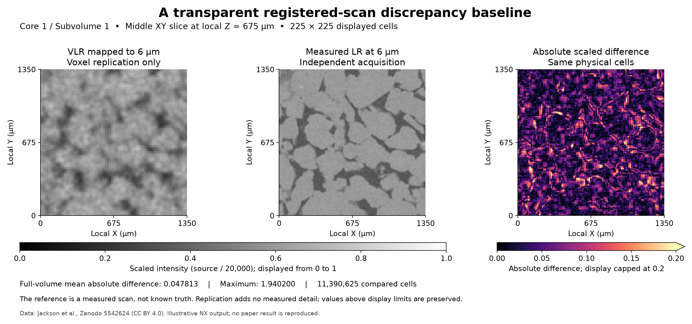

# Bentheimer Common Grid Comparison

Executable pipeline: `(02) Bentheimer Common Grid Comparison.d3dpipeline`

> **Before adapting:** Do not treat this example as a validated acceptance procedure. Adapt and validate it for the scanner, material, resolution, and quality requirement.

## At a glance

| Question | Answer |
| --- | --- |
| Use this when | Registered scans need a transparent common-grid comparison |
| Input | Native Volume Preparation checkpoint from example 01 |
| Main result | Absolute scaled-intensity differences on the 6 µm grid |
| Follow with | `(03) Bentheimer Interior Region Comparison` |

## Purpose and real-world setting

A digital rock analyst may want to locate differences between coarse and fine scans before selecting a segmentation or an image-enhancement method. Comparing raw tuple indices fails when the same specimen occupies 75³ cells in one image and 225³ cells in the other. This example retains both acquisitions, maps the coarse image onto the finer grid, and writes an inspectable discrepancy array.

The discrepancy combines sampling, noise, reconstruction, partial-volume effects, and any residual registration mismatch. The 6 µm image is the comparison reference, not a known true intensity field. Consequently, the output is a registered-scan difference baseline rather than an accuracy score.

## Inputs and workflow

Run example 01 first, following the [README](README.md). This example reads `Data/Output/Bentheimer_Resolution_Examples/Preparation/ImportedVolumes.dream3d`, including both native UInt16 arrays. Their dimensions, spacing, origin, and 1,350 µm physical bounds must match the documented contracts before a cellwise difference is meaningful.

| Step and choice | Reason |
| --- | --- |
| Read DREAM3D | Retain native grids and exact imported source intensities |
| Array Calculator on each native grid, `AuthorNormalizedIntensity / 20000` | Put both scans on the same fixed Float32 scale |
| Resample Image Geometry, exact dimensions 225³ | Map the VLR grid onto 6 µm cells while preserving its field of view |
| Compute Differences Map | Store the absolute difference of the two scaled arrays |
| Compute Array Statistics | Summarize cell count, minimum, maximum, and mean discrepancy |
| Write DREAM3D | Preserve inputs, mapped data, and results together |

The divisor 20,000 comes from the paper's fixed display-range maximum. It is not fitted to either volume and does not repeat the authors' earlier peak-based normalization. Float32 output retains fractional values. Values above one remain present; neither clipping nor conversion to 8-bit occurs. Per-volume min-max normalization would change the comparison by independently stretching each distribution.

The resampler keeps the original geometry and creates `BentheimerVLRMapped6um`. For this exact factor-three upsample, its source-index mapping repeats each coarse voxel three times along each axis. Both the UInt16 source and Float32 scaled array are mapped. The result contains more samples of the same coarse information, with visible block boundaries. A smooth interpolation would make a different baseline; learned enhancement would require a model and separate evidence.

## Outputs and interpretation

The checkpoint is `Data/Output/Bentheimer_Resolution_Examples/Comparison/CommonGridComparison.dream3d`. The difference array is `BentheimerLR6um/CellData/AbsoluteScaledIntensityDifference`; summaries are in `BentheimerComparisonStatistics`. Original native `AuthorNormalizedIntensity` arrays and newly calculated `ScaledIntensity` arrays remain available.

The preview uses the same physical slice location and intensity display range for mapped VLR and measured LR. Its difference scale is separate. Bright discrepancy regions indicate disagreement, which can motivate local inspection; they do not identify pores, failed measurements, or unacceptable material.

## Adaptation and quality checks

Independently replicate the 75³ source array to 225³ and compare all saved mapped voxels. Verify `ScaledIntensity = Float32(source / 20000)` and `difference = abs(mappedScaled - measuredScaled)` over the full volume, with a stated floating-point tolerance. The current difference implementation is absolute despite older documentation describing signed subtraction. Check one-tuple statistics against independent reductions and confirm all arrays are finite.

Equal tuple counts alone are insufficient: origins, spacings, dimensions, and spatial registration must also agree. Preserve values above one when adapting the intensity scale. Do not transfer the paper's threshold 117 to these unfiltered UInt16 or scaled Float32 arrays. If the input scan, scaling, or resampling changes, rerun this example and the interior-region example. Prefer a separately named branch when comparing alternative interpolation methods.

## Scientific basis and extensions

[Jackson et al. (2022)](https://doi.org/10.1103/PhysRevApplied.17.054046) motivates multiresolution comparison and reports the fixed normalization range in Section II.2 of the [reviewed arXiv v2 methods](https://arxiv.org/html/2111.01270v2). Its EDSR and cubic comparison uses 6-to-2 µm images; the paper's released 18 µm data were reserved for further work. Reproduction status here is **illustrative**. No EDSR, cubic interpolation, matched denoising, SSIM optimization, segmentation, or flow result is reproduced.

The measured-derived source files are available under CC BY 4.0 from [Zenodo](https://doi.org/10.5281/zenodo.5542624); see [SourceDataLicense.md](SourceDataLicense.md). Example 03 restricts comparison to the same declared physical interior volume. A later pore-analysis study needs an independently justified segmentation and material-property checks.

For an LLM or MCP assistant: distinguish resampling from new measured resolution and discrepancy from accuracy. Preserve the fixed scaling, absolute-difference semantics, source grids, and checkpoint order.
