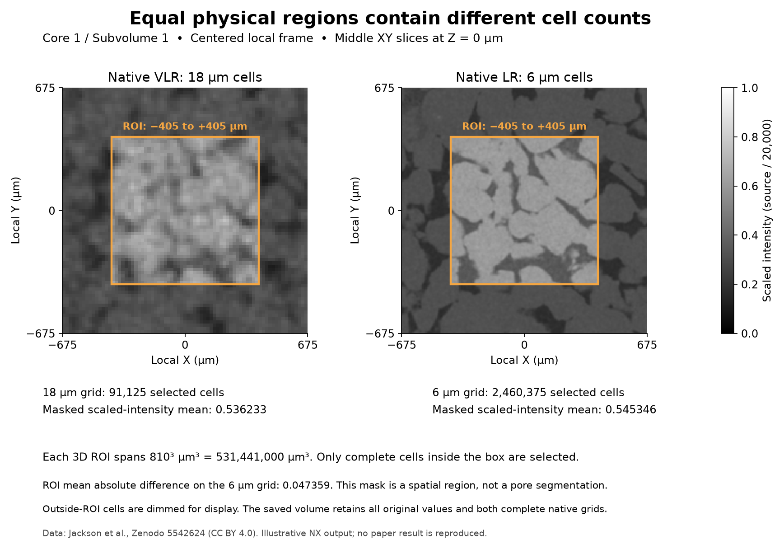

# Bentheimer Interior Region Comparison

Executable pipeline: `(03) Bentheimer Interior Region Comparison.d3dpipeline`

> **Before adapting:** Do not treat this example as a validated acceptance procedure. Adapt and validate it for the scanner, material, resolution, and quality requirement.

## At a glance

| Question | Answer |
| --- | --- |
| Use this when | Two voxel sizes must describe the same physical interior region |
| Input | Common Grid Comparison checkpoint from example 02 |
| Main result | Cell-center coordinates, matching ROI masks, and masked intensity summaries |
| Region | An 810 µm cube centered in the shared field of view |

## Purpose and real-world setting

An analyst inspecting a registered CT pair may want to compare the interior while leaving the complete scans available for context. Choosing the same voxel-index interval on two resolutions would select different physical volumes. This example defines a region in micrometers, selects complete cells on each native grid, and shows where those cells lie in a common local coordinate frame.

The interior region is an example choice, not a detected specimen boundary or pore phase. Its 810 µm side length is not the paper's representative elementary volume, and its intensity mean is not porosity.

## Inputs and workflow

Run examples 01 and 02 using the [README](README.md). This example reads `Data/Output/Bentheimer_Resolution_Examples/Comparison/CommonGridComparison.dream3d`, including native scans, the mapped VLR grid, scaled intensities, and absolute differences.

| Step and choice | Reason |
| --- | --- |
| Read DREAM3D | Preserve comparison results and native sampling |
| Set Image Geometry Origin and Spacing on all three grids | Set the explicit lower-corner origin to −675 µm on each axis; leave spacing unchanged |
| Compute Image Geometry Coordinates on native grids | Store Float32 XYZ cell centers after the geometry placement is final |
| Compute Coordinate Threshold, rectangle [−405,405] µm | Select complete native cells inside the same 810 µm cube |
| Compute Array Statistics with each native ROI mask | Summarize native scaled intensities and the LR-grid absolute difference |
| Write DREAM3D | Save masks, coordinates, summaries, and full source volumes |

The origin edit is a metadata translation into an example-local centered frame. `center_origin` is false because the supplied origin is already the lower corner; the pipeline does not ask the filter to interpret −675 as the center. Bounds become [−675,675] µm for every retained geometry. Translating only one geometry would destroy their common placement even though the arrays retained identical shapes.

Physical coordinates use `origin + (index + 0.5) × spacing`. The three components are X, Y, Z, with X varying fastest through tuples. Native VLR centers run from −666 to 666 µm; LR centers run from −672 to 672 µm. Coordinates are generated after translation to avoid stale arrays copied through a later geometry edit.

## Outputs and interpretation

`Data/Output/Bentheimer_Resolution_Examples/Regions/InteriorRegionComparison.dream3d` retains all three grids. Each native `CellData` gains `CoordinatesMicrometers` and the UInt8 `InteriorROI` mask. Coordinates and masks store flattened, X-fastest cell tuples. Native intensity summaries are stored in each geometry's `InteriorIntensityStatistics`; LR discrepancy summaries are in `BentheimerLR6um/InteriorDifferenceStatistics`.

The rectangle test requires each cell's complete lower and upper corners to lie inside the inclusive bounds. It selects indices 15 through 59 on each VLR axis and 45 through 179 on each LR axis: NumPy slices `[15:60]³` and `[45:180]³`. The expected counts are 91,125 and 2,460,375, a ratio of 27. Multiplying each count by its voxel volume gives the same 531,441,000 µm³. Different cell counts therefore describe equal physical volumes.

## Adaptation and quality checks

Verify that translation leaves all intensity bytes unchanged. Compare coordinate arrays with independent index arithmetic and masks with the full-cell corner predicate. Check masked count, minimum, maximum, and mean against independent reductions over the explicit slices. A center-only predicate happens to agree for these aligned bounds but is not the filter's general contract.

When changing the ROI, select bounds deliberately relative to each grid. Nonaligned boundaries can select different effective volumes because only complete cells qualify. Confirm counts and physical volumes rather than assuming the requested rectangle was filled exactly. Recompute coordinates and masks after any origin or spacing change; changing spacing alone also changes the represented specimen size. To study threshold or ROI sensitivity, preserve separately named variants and report each selected volume.

## Scientific basis and extensions

[Jackson et al. (2022)](https://doi.org/10.1103/PhysRevApplied.17.054046) connects multiresolution imaging with scale-dependent material analysis. The [reviewed arXiv v2](https://arxiv.org/html/2111.01270v2), Section II.5, explicitly motivates representative-volume selection; the supplement's 600 µm two-dimensional display crops are also distinct from this 810 µm three-dimensional ROI. Reproduction status is **illustrative**. These local masks and summaries do not reproduce published EDSR, pore segmentation, permeability, or representative-volume results.

The author-normalized input files are CC BY 4.0 [Zenodo data](https://doi.org/10.5281/zenodo.5542624); [SourceDataLicense.md](SourceDataLicense.md) records attribution and transformations. Further material conclusions require a segmentation and independent physical checks appropriate to the selected volume.

For an LLM or MCP assistant: keep physical units, full-cell membership, voxel-center coordinates, and scanner coordinates distinct. Treat the `.d3dpipeline` as executable authority and preserve the declared predecessor chain.
